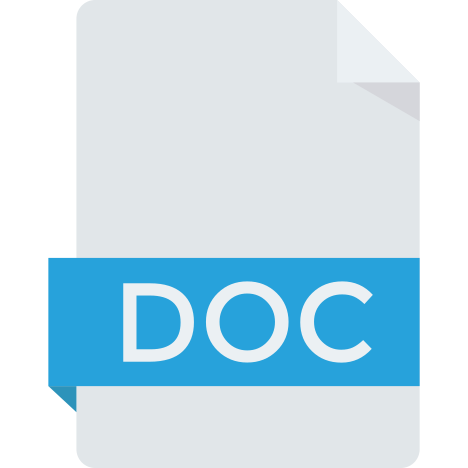

# Introducción

Los procesadores de textos los puedes utilizar para crear, modificar y dar formato
de una manera eficiente a cualquier documento. A lo largo de este curso te vamos
a presentar opciones que, es posible, que no hayas trabajado nunca con ellas e,
incluso, que no sabías ni que existían.
Es importante que prestes mucha atención al curso, no quedándote descolgado e
intentado hacer un poco cada día.

## Punto de partida

Para realizar el curso hay que tener conocimientos básicos de los procesadores de
textos, ya sea Microsoft Word u OpenOffice Writer, ya que algunas de las
actividades y tareas que te presentaremos requieren conocer estos aspectos.

