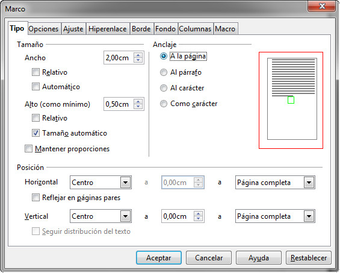
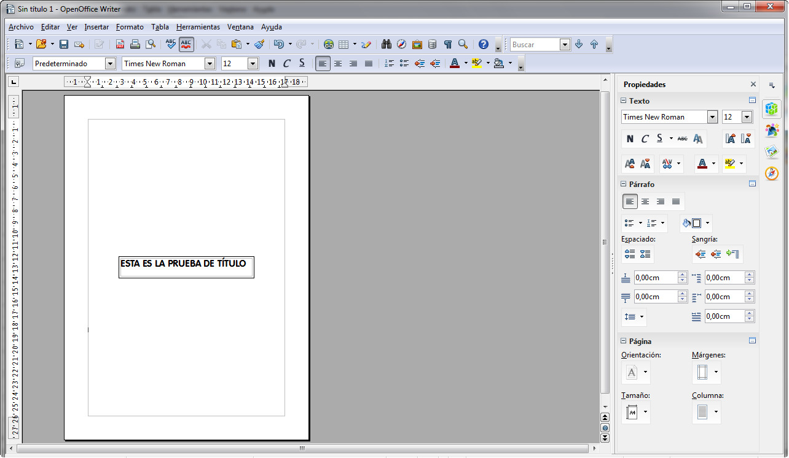

# Alineación vertical (OpenOffice)

En OpenOffice Writer no es fácil descubrir cómo alinear verticalmente texto con la página para poner títulos en una portada, por ejemplo. Sin embargo, no te apures, es bastante sencillo. Para ello, añadiremos un marco a través del menú Insertar, opción **Marco**, apareciéndote un cuadro de diálogo como el que puedes ver en la siguiente imagen.

Ahora lo que tenemos que indicarle es el anclaje del marco, colocándolo en relación **A la página** y en el centro, tanto vertical como horizontalmente (tal y como te hemos mostrado en la figura anterior).

El resultado final podría ser como este que te mostramos en la siguiente imagen. 

