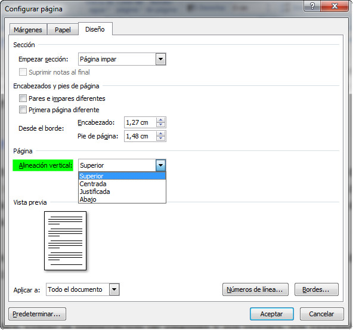
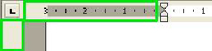

# Alineación vertical (Word)

Habitualmente trabajamos con una alineación vertical superior, el texto se coloca en la página a partir del margen superior. Pero puede interesarnos centrarlo (el típico cartel de "vuelvo en un momento" escrito en un papel) y, si desconocemos esta opción, lo haremos a mano (a base de dejar líneas en blanco por arriba o de borrar las que sobren).

En todos los casos, la ubicación de las selecciones que hagamos, puede decidirse mediante el desplegable **Aplicar a**.

## Importante

Cuando trabajamos en el modo Diseño de impresión y queremos modificar la configuración de página basta hacer doble clic en cualquiera de las zonas grises de las reglas (horizontal o vertical) para que se abra el cuadro de diálogo Configurar Página.

