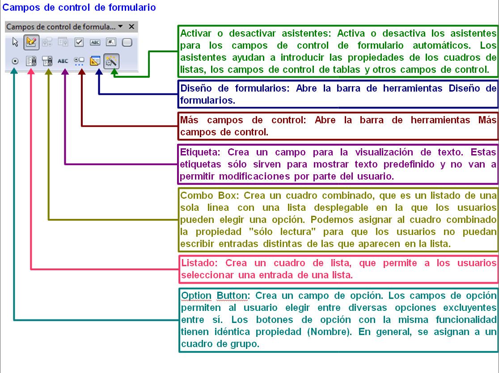

# Bordes y sombreado

Los bordes y el sombreado se utilizan para resaltar algunos párrafos, o palabras, del documento. En los diferentes procesadores de textos se pueden poner diversos tipos de bordes y de sombreados.

Para que veas la aplicación de bordes y sombreados, fíjate en la siguiente imagen.

 

_Fig. 2.7. Aplicación de bordes y sombreados a diferentes párrafos. Captura propia._

Como puedes comprobar, el aspecto que se le da al texto es muy diferente y mucho más atractivo con la utilización de estas opciones.

Para conocer todas las posibilidades de cada programa, puedes acceder a los siguientes enlaces:

**Word 2007**

**Open Office Writer**

[Bordes](http://office.microsoft.com/es-es/word-help/decorar-los-documentos-o-las-imagenes-con-bordes-HA010100052.aspx?CTT=1 "Bordes con Word 2007")

[Bordes](http://wiki.open-office.es/La_pesta%C3%B1a_Borde "Bordes con Writer")

[Sombreados](http://office.microsoft.com/es-es/outlook-help/aplicar-sombreado-a-palabras-o-parrafos-HA010275399.aspx?CTT=1 "Sombreado con Word 2007")

[Sombreados](http://wiki.open-office.es/Definir_un_color_de_fondo "Sombreado con Writer")

