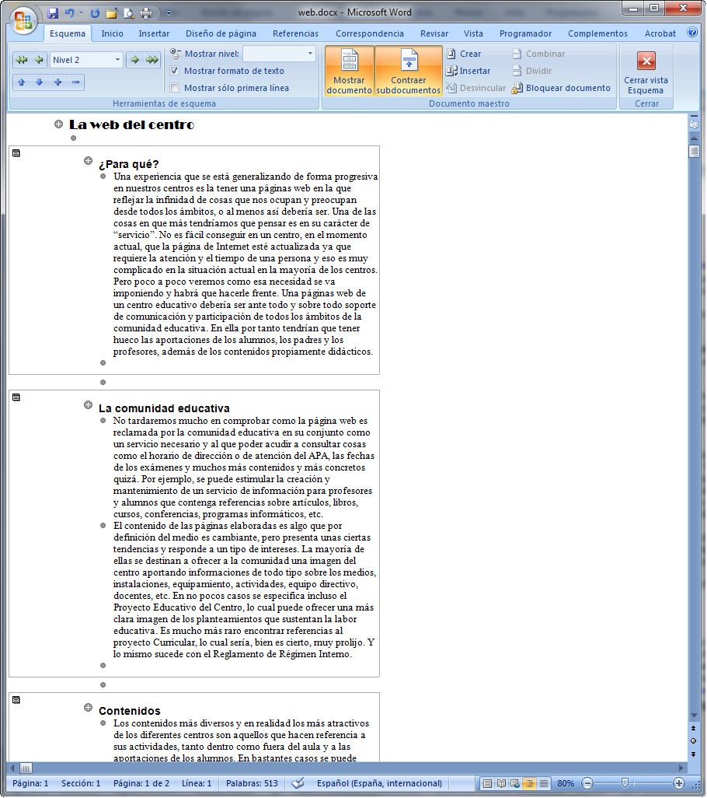

# Calcular, ordenar y realizar gráficos con tablas

**Cálculos mediante una tabla**

Una tabla puede servirnos como una pequeña hoja de cálculo, mediante la introducción de fórmulas. Para realizar esta tarea, usamos la herramienta **fórmulas**. La codificación que tiene cada celda es la misma que en las hojas de cálculo, es decir, las columnas se numeran con letras (A, B, C...) y las filas con números (1, 2, 3...).

Para conocer cómo operar con fórmulas en una tabla, puedes acceder a los siguientes enlaces:

*   Fórmulas en una tabla con [Word 2007](http://office.microsoft.com/es-hn/word-help/usar-una-formula-en-una-tabla-de-word-HA102329800.aspx?CTT=1 "Fórmulas en una tabla con Word 2007").
*   Fórmulas en una tabla con [OpenOffice Writer](http://wiki.open-office.es/Insertar_formulas_en_celdas "Fórmulas en una tabla con Writer").

## Actividad

Observa, en la imagen siguiente, la tabla que aparece. Haz una en un documento nuevo, con el mismo número de filas y columnas, en la que introducirás los datos que figuran en las zonas amarilla y verde. Las letras y números de los extremos aparecen a título informativo, no las pongas.

_Fig. 2.15. Ejercicio para trabajar con fórmulas en una tabla. Captura propia.  
_

**Ordenar en una tabla**

Dentro de una tabla, puedes ordenar cualquier secuencia de filas, desde la opción que tienen los procesadores de textos para ello, solo tienes que elegir las preferencias de orden.

Si quieres saber cómo puedes realizar ordenaciones en una tabla, accede a los siguientes enlaces:

*   Ordenaciones con [Word 2007](http://office.microsoft.com/es-hn/word-help/ordenar-el-contenido-de-una-tabla-HA010034303.aspx?CTT=1 "Ordenaciones en Word 2007").
*   Ordenaciones con [OpenOffice Writer](http://wiki.open-office.es/Ordenar_una_tabla "Ordenaciones en Writer").

**Gráficos con los datos de una tabla**

Aunque un procesador de textos no es el programa adecuado para realizar un gráfico, sí que es cierto que cualquier tabla con apartados numéricos es susceptible de ser representada en un gráfico estadístico.

Mira la siguiente imagen:

_Fig. 2.16. Utilizando un procesador de textos para realizar gráficos. Captura propia._

En los siguientes enlaces puedes ver cómo se puede realizar un gráfico como el que aparece en la figura, y otros muchos más:

*   Gráficos con [Word 2007](http://office.microsoft.com/es-hn/word-help/presentar-datos-en-un-grafico-HA010099739.aspx?CTT=1 "Crear un gráfico con Word 2007").
*   Gráficos con [OpenOffice Writer](https://help.libreoffice.org/Common/Inserting_Charts/es "Crear un gráfico con Writer").

## Actividad

En la imagen anterior has visto un gráfico, además de muchas otras opciones, ¿serías capaz de hacerlo? Seguro que sí. ¡¡Prueba a ver!!

