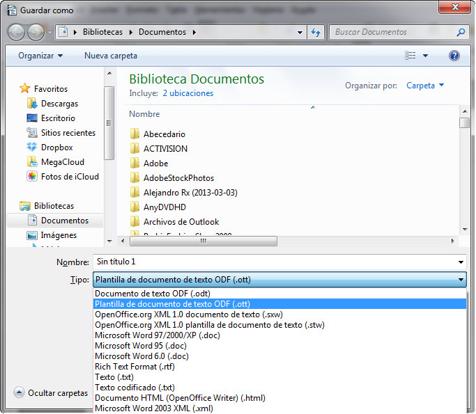
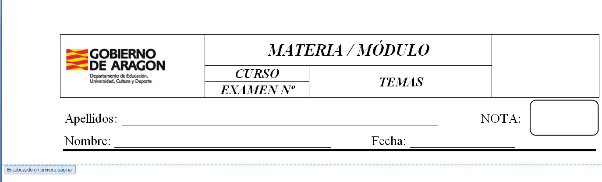

# Creación de una plantilla (OpenOffice)

Si trabajas con OpenOffice Writer, la creación de una plantilla es muy similar al que te hemos explicado anteriormente, solo que ahora seleccionarás la opción **Plantilla de documento de texto ODF**.

 _Fig. 1.39. Creación de una plantilla con Write. Captura propia._

En el siguiente vídeo puedes ver cómo crear una plantilla en OpenOffice Writer.

_Vídeo 1.3. Creación de plantillas en Writer. Fuente: Youtube._

Si todavía tienes dudas de cómo trabajar con plantillas, visita este enlace:

*   Plantillas en [OpenOffice Writer](http://wiki.open-office.es/Trabajar_con_plantillas "Plantillas en Write").

## Reflexión

Una vez que has estudiado qué son y para qué sirven las plantillas, ¿dónde crees que puedes sacarlas el máximo provecho a nivel educativo?

var feedback82_9text = "Mostrar retroalimentación";

### Retroalimentación

Una de las funciones más útiles con las plantillas es la creación de exámenes en los que, por ejemplo, siempre utilizo el mismo encabezado y pie de página. Imagina que en todos los exámenes quieres utilizar el encabezado que te mostramos en la siguiente imagen.

_Fig. 1.40. Ejemplo de una plantilla para la creación de un examen con el mismo encabezado. Captura propia._