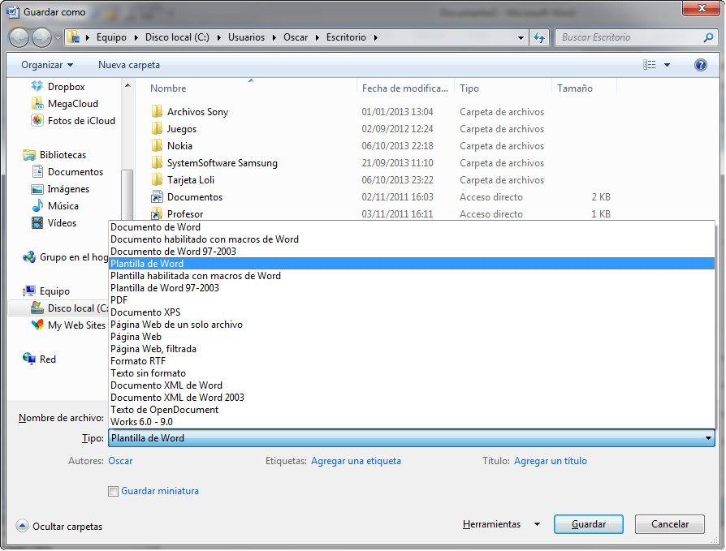

# Creación de una plantilla (Word)

Crear una plantilla es una acción muy sencilla, ya que la tarea fundamental es decidir qué elementos vas a incluir en la misma.

Una vez que ya has decidido qué es lo que va a contener la plantilla, lo único que tienes que indicarle a Word es que el tipo de documento es una plantilla, y esto lo harás seleccionando la opción **Plantilla de Word** en el cuadro de diálogo Guardar, tal y como puedes ver en la siguiente imagen.

En el siguiente enlace puedes ver una explicación de cómo trabajar con plantillas:

*   Trabajo con plantillas en [Word 2007](http://office.microsoft.com/es-es/word-help/crear-una-plantilla-HA010030754.aspx?CTT=1 "Trabajando con plantillas en Word").

## Importante

Además del tipo de archivo que te hemos indicado anteriormente (Plantilla de Word), el programa nos permite seleccionar otros dos tipos que también son plantillas:

*   Plantilla con macros.
*   Plantilla con formato de versiones anteriores.

## Pregunta Verdadero-Falso

<quiz name=""><question>
Cuando en Word 2007 quiero crear una plantilla, ésta solamente puede ser guardada en un único formato.
<answer>Verdadero</answer><answer correct>Falso</answer><explanation>Además del formato Plantilla, también existen las Plantillas con macros y Plantillas de versiones anteriores a la 2007.</explanation></question></quiz>

