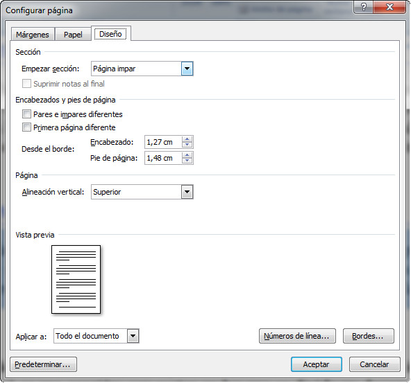

# Diseño

Es una de las que más utilizarás en este curso y, seguramente, en tu posterior trabajo con Word. Algunas de sus funciones son específicas, y a ellas dedicaremos más atención, otras son accesibles desde otros puntos del programa y están enlazadas con el módulo en el que se desarrollan.

