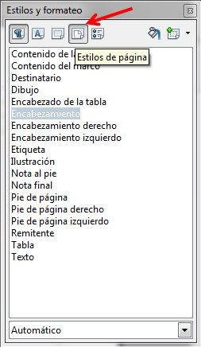
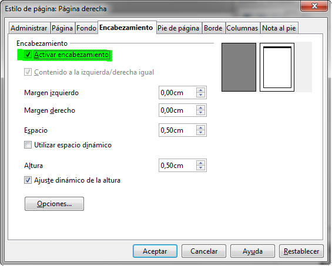
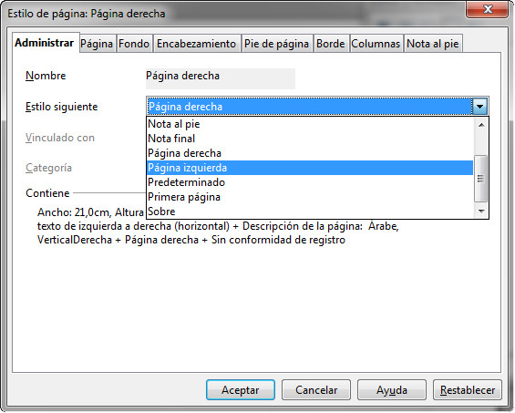

# Encabezados y pies alternos (OpenOffice)

Al igual que sucede con Word, en OpenOffice Writer puedes usar encabezados y pies de página diferentes en varias páginas del documento, siempre que las éstas usen estilos diferentes.

Debes tener en cuenta que OpenOffice Writer proporciona varios estilos de páginas predefinidos, como **Primera página**, **Página izquierda** y **Página derecha**, o bien puedes crear un estilo personalizado. Por ejemplo, si lo que deseas es establecer encabezados diferentes para las páginas pares e impares de un documento, tienes que llevar a cabo los siguientes pasos:

1\. Elije la opción **Estilos y formateo** del menú Formato y haz clic en el símbolo Estilos de página.

  
2\. Pulsa con el botón derecho del ratón sobre **Encabezamiento derecho** en la lista de estilos de página y elije Modificar.
  
3\. En el cuadro de diálogo Estilos de página, haz clic en la ficha Encabezamiento, y marca la casilla Activar encabezamiento.

4\. Ahora, haz clic en la ficha Administrar, y en el cuadro Estilo siguiente, selecciona Página izquierda y pulsa en el botón Aceptar.

  
5\. En el cuadro de diálogo Estilos y formateo, haz clic con el botón derecho en Página izquierda en la lista de estilos de página y vuelve a realizar las operaciones indicadas anteriormente, pero cuando llegues a la ficha Administrar nuevamente, deberás seleccionar en el cuadro Estilo siguiente **Página derecha**.

6\. Si haces doble clic sobre Página derecha en la lista de estilos, aplicarás este estilo a la página actual.