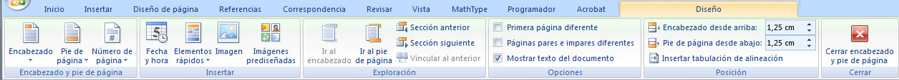
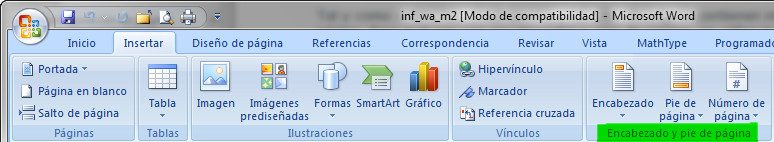
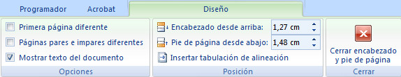

# Encabezados y pies alternos (Word)

Tal y como sabes, los encabezados y los pies de página contienen información que se imprime en las partes superior e inferior de cada página. Para trabajar con encabezados y pies de página, se utiliza la ficha Diseño, que aparece cuando se inserta un encabezado o pie de página nuevo.

La zona de encabezados y pies de página aparece delimitada por un rectángulo discontinuo; si ya hay encabezados o pies y se quiere editarlos, pueden activarse haciendo doble clic sobre esta zona.

>**info**
>
>## Importante
>
>Si es la primera vez que quieres insertar un encabezado o pie de página, tendrás que hacerlo a través de la ficha Insertar, grupo Encabezado y pie de página tal y como puedes ver en la siguiente imagen.
>
>
>

Para poder trabajar con encabezados y pies de página alternos y diferentes en cada sección, tendremos que utilizar con frecuencia las opciones que figuran en la ficha Diseño, concretamente las que puedes ver en la siguiente imagen:

*   **Primera página diferente** permite diferenciar los encabezados y pies de la primera página de las restantes cuando aquélla es, por ejemplo, una portada.
*   **Páginas pares e impares diferentes** permite alternar encabezados y pies en páginas pares e impares.
*   **Mostrar texto del documento** nos permite ver lo que hemos escrito en el documento. Si lo desmarcamos, veremos la hoja del documento en blanco.