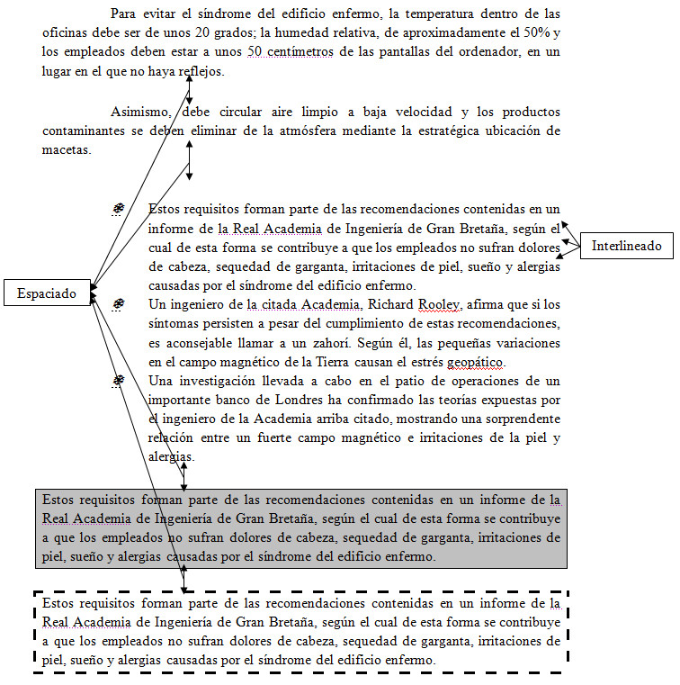

# Espaciados e interlineados

Ahora nos encontramos con dos conceptos que, aunque a priori pueden parecer lo mismo, no lo son.

El **espaciado** es la distancia que se deja entre un párrafo y otro, ya sea el anterior o el siguiente (o ambos). El **interlineado** es la separación que dejamos entre las diferentes líneas que tiene un párrafo.

En la siguiente imagen te lo mostramos de forma gráfica:

Para conocer todo lo que puedes hacer con los espaciados e interlineados en cada programa, puedes acceder a los siguientes enlaces:

*   Espaciados e interlineados en [Word 2007](http://office.microsoft.com/es-es/word-help/ajustar-los-espacios-entre-lineas-o-parrafos-HP010016523.aspx?CTT=1 "Espaciados e interlineados en Word 2007").
*   Espaciados e interlineados en [OpenOffice Writer](http://wiki.open-office.es/La_pesta%C3%B1a_sangr%C3%ADas_y_espacios "Espaciados e interlineados en Writer").

