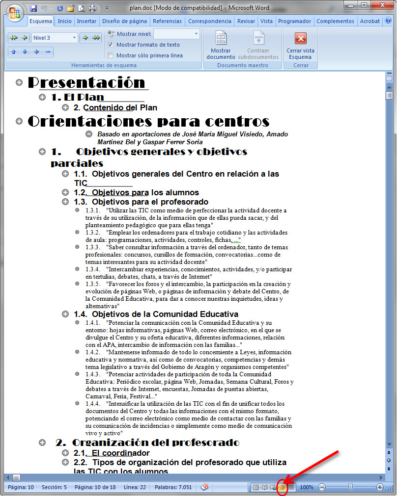
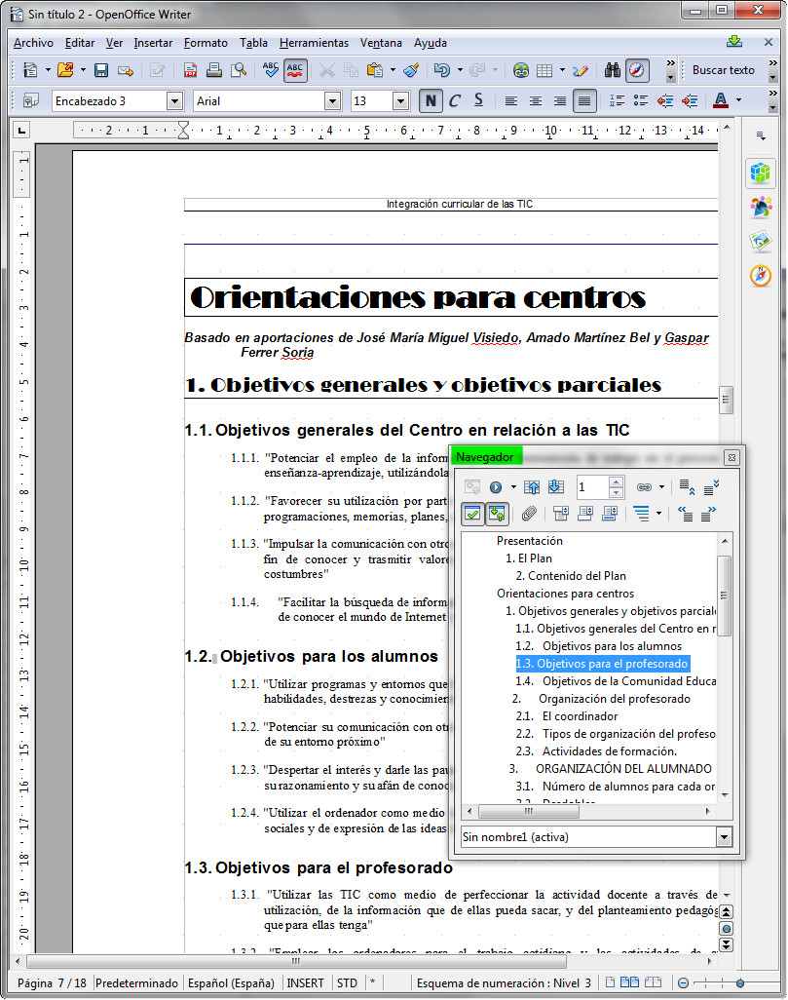

# Esquemas

Debes tener en cuenta que en esta opción sí que existen ligeras diferencias entre los procesadores de textos que estamos viendo en este curso, aunque el resultado que se obtiene en cualquiera de ellos es el mismo.

En las dos imágenes siguientes te mostramos dos documentos en los que está activada la vista de esquema.

Aunque a simple vista las imágenes son muy diferentes, no te preocupes, la forma de trabajo es muy similar.

Para conocer todo lo que puedes hacer con la vista de esquema en cada programa, accede a los siguientes enlaces:

*   Trabajando en vista esquema en [Word 2007](http://www.slideshare.net/kudaj_1990/esquemas-e-indices-en-word "Vista de esquema en Word").
*   Trabajando en vista esquema en [OpenOffice Writer](http://wiki.open-office.es/Que_es_el_Navegador_de_OpenOffice_Writer "Vista de esquema en Write").

>**tip**
>
>## Actividad
>
>En el siguiente enlace tienes un pequeño ejercicio para practicar los esquemas en Word 2007.
>
>[Trabajando con esquemas en Word](https://docs.google.com/viewer?a=v&pid=sites&srcid=ZGVmYXVsdGRvbWFpbnxpZXN2cHNlcHRpbW9zfGd4OjZjZmVkMDFlMjk1YzZlZGU "Esquemas con Word")

Si todavía estás un poco inseguro con la utilización de los esquemas, ¡¡no te apures!! con este videotutorial seguro que consigues dominar esta opción.

https://youtu.be/5AzAFeNtEac

