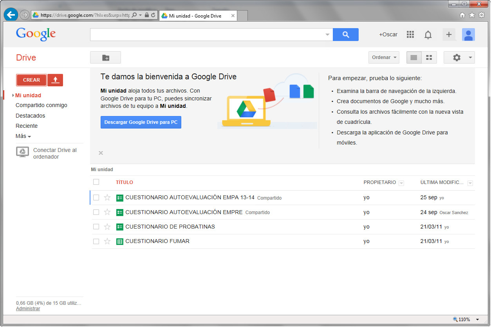
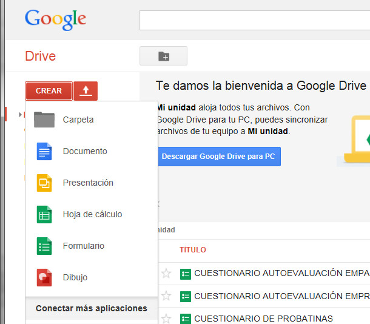

# M2: LA EDICIÓN Y EL FORMATO DEL DOCUMENTO

Conocer todas las opciones que pueden utilizarse al trabajar con párrafos permite al usuario de los procesadores de textos dar a los documentos un aspecto diferente. Las sangrías y las listas con viñetas proporcionarán al lector una mejor comprensión del contenido al permitir la escritura a distintos niveles. Los diferentes espaciados entre párrafos y líneas permitirán diferenciar distintos tipos de texto. El control de líneas y palabras, facilitará la permanencia en la misma página de conceptos complejos...

Fíjate en la siguiente imagen:

_Fig. 2.1. Documento con algunos formateos aplicados. Captura propia._

Y ahora fíjate en esta:

_Fig. 2.2. Ejemplo de documento formateado. Captura propia._

¿A qué hay una gran diferencia entre ellas?

Cuando finalices el módulo serás capaz de dejar tus documentos con una apariencia similar a la de la imagen anterior.

## Objetivos

Los objetivos a alcanzar con este módulo son:

*   Controlar las distintas opciones de párrafo y línea.
*   Formatear un documento con distintos tipos de columnas.
*   Saber utilizar las tabulaciones.
*   Utilizar opciones avanzadas de formato que faciliten el trabajo.
*   Formatear tablas con todas sus posibilidades.
*   Definir y utilizar estilos.

