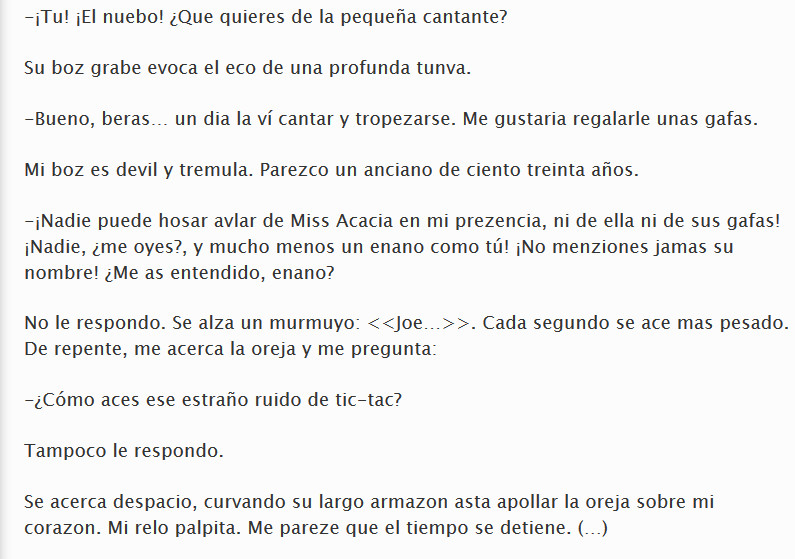

# M3: LAS REVISIONES DEL DOCUMENTO

Vas avanzando en el curso, y ahora te toca aprender de qué forma se pueden realizar revisiones a un documento. Para empezar, te proponemos que leas lo que te mostramos en la siguiente figura:

3.1. Extracto de "La mecánica del corazón" de Mathias Malzieu. Captura propia.  

¿Qué has podido comprobar en este extracto? ¡¡Efectivamente!! Muchas faltas de ortografía y gramaticales.

A lo largo de este módulo te vamos a enseñar cómo revisar un documento para que estas cosas no ocurran. De la misma forma, te enseñaremos a introducir comentarios en un documento y a trabajar con el control de cambios.

## Objetivos

Los objetivos que se pretenden con este módulo son:

*   Manejar las revisiones ortográfica y gramatical.
*   Utilizar el diccionario de sinónimos.
*   Saber utilizar los comentarios.
*   Utilizar el control de cambios.

