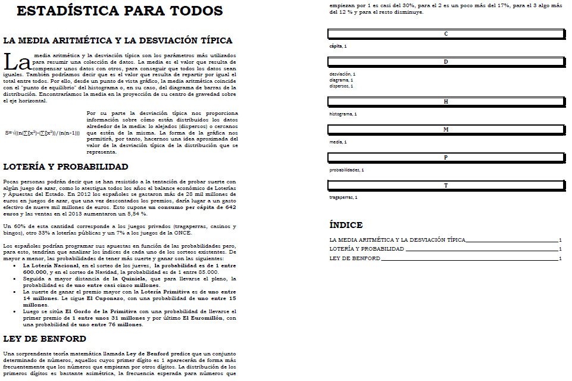
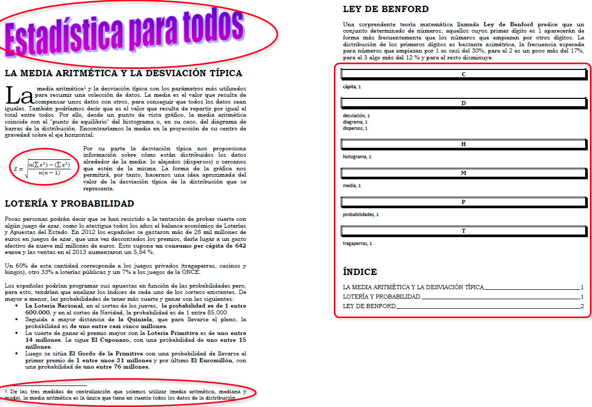

# M4: LA MEJORA DEL DOCUMENTO

Ya has superado el ecuador del curso y a lo largo de este módulo te vamos a enseñar algunas opciones que le darán a nuestro documento un aspecto diferente.

Fíjate en el documento de esta imagen:

Y ahora fíjate en este otro documento:

Aunque a simple vista parece que la única diferencia está en el título y en la fórmula que aparece, en realidad hay otras muchas diferencias, y es en la forma en que se han generado los índices, tanto el de palabras como el de contenido, que se ha realizado a través de opciones específicas que tienen los procesadores de texto, de tal manera que de forma automática son insertadas en el documento.

A lo largo de este módulo te enseñaremos a mejorar la apariencia del documento a través de diferentes opciones.

## Objetivos

Los objetivos que se pretenden con este módulo son:

*   Trabajar con letras capitales.
*   Entender la diferencia entre nota al pie y nota al final.
*   Organizar los documentos mediante tablas de contenido e índices.
*   Aprender a utilizar el editor de ecuaciones.

