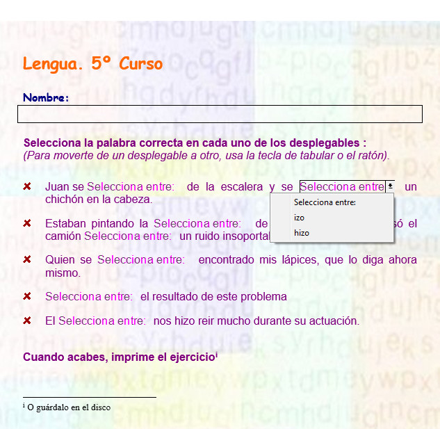
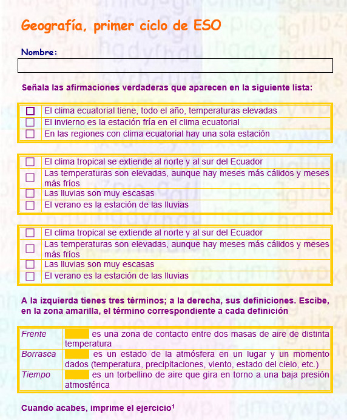

# M5: INTERACTIVIDAD

Hemos llegado ya al penúltimo módulo del curso y ahora nos vamos a ocupar de opciones que seguramente no habrás utilizado nunca, lo cual no significa que no sean útiles alguna vez en nuestra docencia.

Fíjate en las siguientes imágenes:

Estas son algunas de las cosas que se pueden hacer con los formularios.

Además, en este módulo aprenderás a realizar una opción que es muy habitual en las empresas: la combinación de correspondencia, que no es otra cosa que el envío masivo de un documento, carta, elaboración de sobres...

Por último, aunque no por ello es menos importante, aprenderás a trabajar con los esquemas, documentos maestros y subdocumentos, especialmente útiles cuando se trabajan con documentos muy extensos.

¿Estás preparado para empezar este módulo? Pues, ¡¡adelante!!

## Objetivos

Los objetivos que se pretenden con este módulo son:

*   Saber trabajar con formularios.
*   Manejar la creación de cartas y otros documentos personalizados.
*   Utilizar la vista esquema y el trabajo con documentos maestros y subdocumentos.

