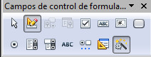

# La revisión gramatical

La revisión gramatical trata de corregir los errores en la estructura de las frases. Para realizar esta corrección el procesador de textos debe trasladar a un lenguaje lógico todas las reglas que rigen la gramática castellana y, además, debe ser capaz de realizar todas las combinaciones que el idioma permite. Esta es una tarea mucho más compleja que comprobar si una palabra existe en el diccionario. Por lo tanto, no es de extrañar que la revisión gramátical realizada por los procesadores de textos no sea tan perfecta como la revisión ortográfica.

## Importante

Dada la complejidad de las explicaciones gramaticales que proporcionan los procesadores de textos, su uso educativo está restringido a niveles de enseñanzas medias y la decisión del uso tiene que tomarla el profesorado, una vez analizado su comportamiento. Conviene, pues, tenerla activada durante un tiempo para analizar su utilidad y su adecuación al nivel.

Has de teber en cuenta que la revisión gramatical no se activa hasta el final de la frase, una vez puesto el punto, realizando una **marca de color verde** en los posibles errores gramaticales.

Cuando el procesador de textos encuentra algún error gramatical muestra un cuadro de diálogo muy similar al que muestra el corrector ortográfico. En las dos imágenes siguientes puedes ver las opciones que tiene, tanto en Word como en OpenOffice Writer.

_Fig. 3.3. Error gramatical en Word. Captura propia._

_Fig. 3.4. Error gramatical en Writer. Captura propia._

## Importante

Para que OpenOffice Writer pueda reconocer los errores gramaticales es necesario instalar una extensión. Esta extensión la puedes encontrar en el siguiente enlace:

*   [Corrector gramatical Language Tool para Writer](http://languagetool-es.blogspot.com.es/ "Extensión para instalar corrector gramatical en Writer").

