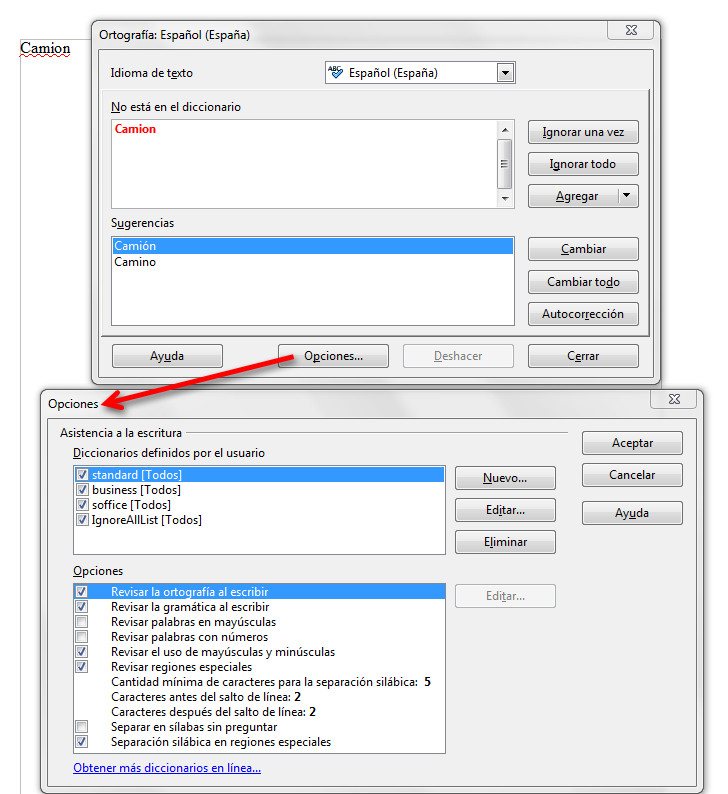

# La revisión ortográfica

La revisión ortográfica consiste en comprobar que las palabras de nuestro texto no son erróneas y, tal y como te hemos indicado anteriormente, existen dos formas básicas de revisar la ortografía: revisarla una vez concluida la introducción del texto o revisarla mientras se va escribiendo el texto.

Para conocer todo lo que puedes hacer con la corrección ortográfica en cada programa, puedes acceder a los siguientes enlaces:

*   Revisión ortográfica en [Word 2007](http://office.microsoft.com/es-es/word-help/revisar-la-ortografia-y-la-gramatica-HP010117963.aspx?CTT=1#BM2 "Revisión ortográfica con Word").
*   Revisión ortográfica en [OpenOffice Writer](http://wiki.open-office.es/Revision_ortografica_en_OpenOffice_Writer "Revisión ortográfica con Writer").

>**info**
>
>## Importante
>
>Tal y como te hemos dicho anteriormente, el corrector ortográfico compara las palabras del documento con las del diccionario principal. El diccionario principal contiene la mayoría de las palabras comunes, pero es posible que no incluya nombres propios, términos técnicos, acrónimos, etcétera. Para evitar que el corrector ortográfico pregunte por tales palabras, puedes agregarlas a un diccionario personalizado.

### Diccionarios personalizados

Aunque los procesadores de textos vienen todos con su diccionario, puedes crear tus propios diccionarios personalizados. Por ejemplo, puedes crear un diccionario para cada área, materia o módulo, o crear diccionarios específicos para utilizarlos al revisar texto en otros idiomas. Para poder utilizar un diccionario personalizado en la revisión ortográfica, es necesario activarlo.

Para saber cómo se trabaja con los diccionarios personalizados en Word 2007 accede al siguiente enlace:

*   Diccionario personalizado con [Word 2007](http://office.microsoft.com/es-es/word-help/usar-diccionarios-personalizados-para-agregar-palabras-al-corrector-ortografico-HA010147298.aspx?CTT=1#BM3 "Diccionario personalizado con Word").

Si lo que utilizas es OpenOffice, no te preocupes, que también vas a poder crear diccionarios personalizados y su funcionamiento es prácticamente el mismo que el que has podido ver en el enlace anterior de Word. Cuando accedas al cuadro de diálogo de Ortografía, basta con pinchar en el botón Opciones, y desde allí podrás crear tu propio diccionario, tal y como puedes ver en la siguiente imagen.

## Actividad

Crea un diccionario personalizado para tu área, materia o módulo en el que incluirás, al menos, veinte palabras específicas; guárdalo y déjalo activo.

