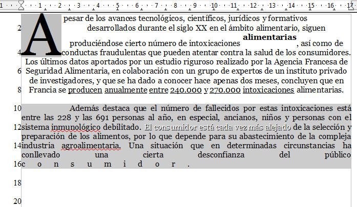

# Las opciones de línea

**La línea**

Anteriormente hemos visto cómo numerar párrafos, es decir, cómo crear listas numeradas, pero, en ocasiones, puede ser muy útil numerar las líneas. Cuando se trata de analizar un documento en profundidad, para presentar alternativas al contenido o para comentar algunas cuestiones referentes al mismo, puede facilitarse la tarea numerando las líneas.

Fíjate en la siguiente imagen.

Visita estos enlaces para aprender a numerar las líneas:

*   [Word 2007](http://office.microsoft.com/es-es/word-help/agregar-o-quitar-numeros-de-linea-HP001229279.aspx?CTT=1 "Numeración de líneas con Word 2007").
*   [OpenOffice Writer](http://blog.open-office.es/index.php/writer/2012/06/11/anadir-numeracion-de-lineas-a-un-documento-openoffice-writer "Numeración de líneas con Writer").

