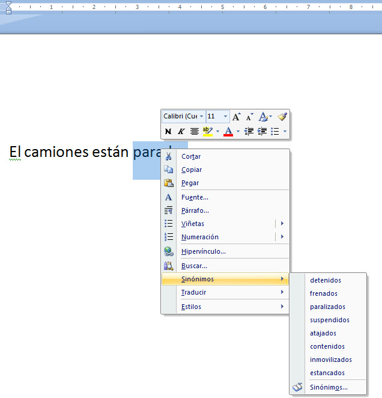
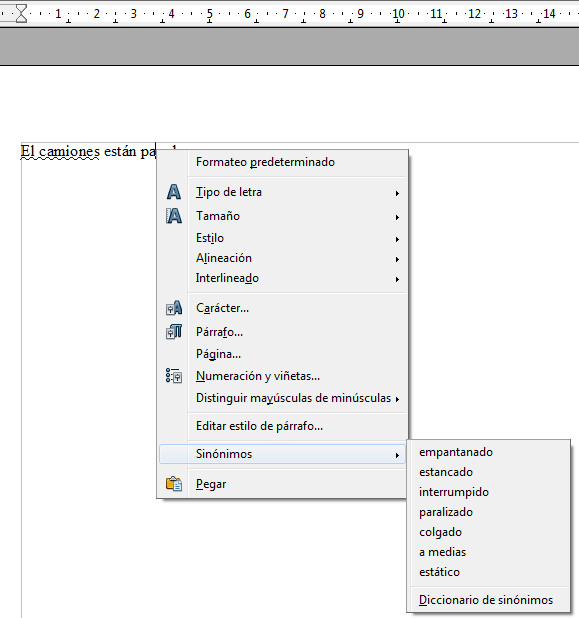

# Los sinónimos

El uso de los sinónimos provoca parecidos reparos entre el profesorado que los que provoca la ortografía, sin embargo, es innegable que es una buena herramienta para adquirir vocabulario, siempre que se use con un criterio didáctico. De todos modos, la única diferencia existente entre el uso del diccionario de sinónimos tradicional y el electrónico es el formato.

La forma de usar el diccionario de sinónimos es muy sencilla, basta con poner el cursor encima de la palabra deseada, hacer click con el botón derecho del ratón y, en la lista desplegable, nos aparecerá la opción de **Sinónimos**, tal y como puedes ver en las figuras siguientes.

