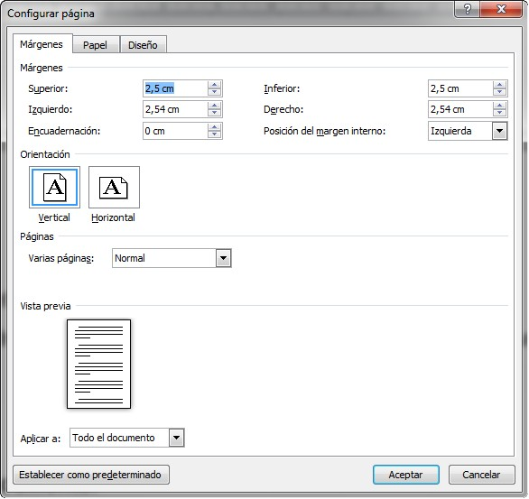
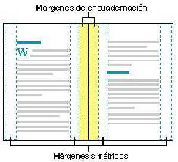
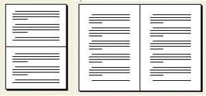

# Márgenes (Word)

La opción márgenes, incluye, además de la posibilidad ya conocida de introducir las medidas de los márgenes, otras opciones:

*   El margen de **encuadernación**, permitirá crear un margen adicional, cuya posición variará si usamos márgenes simétricos o permanecerá a la izquierda si no los usamos.
*   **Márgenes simétricos** ajusta los márgenes izquierdo y derecho de forma que cuando imprima en ambos lados de la página, los márgenes internos de las páginas opuestas y los márgenes exteriores tengan el mismo ancho. Normalmente no disponemos de impresoras que impriman a dos caras, pero, como veremos más adelante, podemos imprimir primero las páginas pares, volver a colocar el mazo en la impresora, e imprimir las impares por la otra cara. También es muy habitual fotocopiar por las dos caras documentos impresos a una cara. En estos casos, conviene hacer los márgenes simétricos.

*   **Dos páginas por hoja** divide, a la hora de imprimir, la hoja en dos partes e imprime la primera página en la primera parte de la hoja y la segunda página en la segunda parte de la hoja. Esta casilla de verificación se utiliza cuando la página que se va a imprimir se dobla por la mitad, por ejemplo para la creación de un díptico, y las dos páginas quedan en la parte interior. Los márgenes externos (encuadernación) de la página y los internos tendrán el mismo ancho. Esta disposición de página no es visible desde la vista preliminar en la que cada una de las dos páginas que ocuparán la hoja aparecen de forma independiente.

El desplegable **Aplicar a** permite decidir si los cambios se fijarán en todo el documento o sólo en una parte.

Para conocer todo lo que puedes hacer con los márgenes en Word, puedes acceder al siguiente enlace:

*   Márgenes en [Word 2007](http://office.microsoft.com/es-es/word-help/cambiar-o-establecer-los-margenes-de-pagina-HP001226492.aspx?CTT=1 "Establecer márgenes en Word 2007").