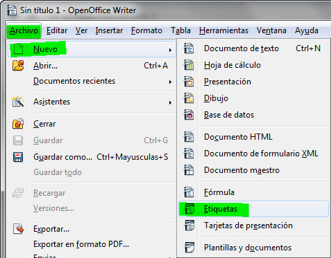

# Más combinación de correspondencia

Si todavía no te ha quedado muy claro, o quieres repasar lo aprendido, puedes acceder a los siguientes videotutoriales.

https://youtu.be/qbXSH2ttZLc

https://youtu.be/sz6rs7qrq6g

https://youtu.be/UVUApzCNcEM

https://youtu.be/IrjLnty5zuE

https://youtu.be/YAoZx_206kc

## Importante

Con la combinación de correspondencia, en Microsoft Word, además de crear cartas, puedes generar también etiquetas y sobres.

En OpenOffice también puedes generar etiquetas en el menú Archivo, opción Nuevo.

## Actividad

Imagina que tienes que mandar las faltas de asistencia de los alumnos a casa. Utilizando la combinación de correspondencia genera etiquetas con la siguiente información:

*   Nombre y apellidos del padre, madre o tutor del alumno.
*   Dirección (completa: calle, número y puerta).
*   Código postal.
*   Población.

Puedes escoger el formato de etiquetas que quieras.

Haz etiquetas para un mínimo de 5 alumnos.

