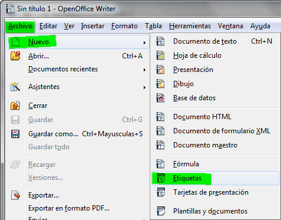

# Más combinación de correspondencia

Si todavía no te ha quedado muy claro, o quieres repasar lo aprendido, puedes acceder a los siguientes videotutoriales.

_Vídeo 5.3. Cómo combinar correspondencia con Word 2007. Fuente: Youtube._

_Vídeos 5.4., 5.5., 5.6. y 5.7. Cómo combinar correspondencia con Writer. Fuente: Youtube._

## Importante

Con la combinación de correspondencia, en Microsoft Word, además de crear cartas, puedes generar también etiquetas y sobres.

En OpenOffice también puedes generar etiquetas en el menú Archivo, opción Nuevo.

_Fig. 5.11. Creación de etiquetas en OpenOffice Writer. Captura propia._

## Actividad

Imagina que tienes que mandar las faltas de asistencia de los alumnos a casa. Utilizando la combinación de correspondencia genera etiquetas con la siguiente información:

*   Nombre y apellidos del padre, madre o tutor del alumno.
*   Dirección (completa: calle, número y puerta).
*   Código postal.
*   Población.

Puedes escoger el formato de etiquetas que quieras.

Haz etiquetas para un mínimo de 5 alumnos.

