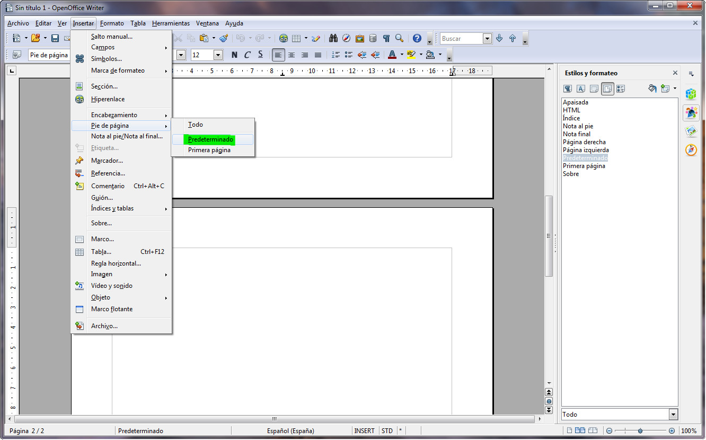
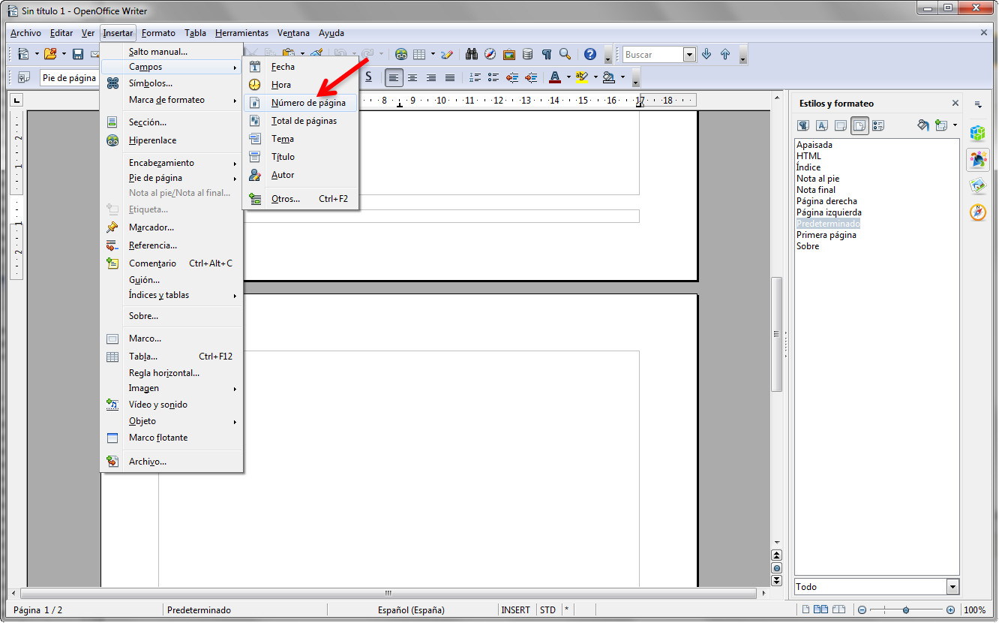

# Numeración de páginas (OpenOffice)

Tal y como te hemos explicado en el apartado anterior, lo habitual es que la numeración de página se sitúe en el pie de página, aunque no existe ningún inconveniente para que la numeración se realice en el encabezado.

Al trabajar con OpenOffice, la forma de insertar estos números de página difiere un poco a lo que has estudiado de Word pero, ¡¡no te preocupes, que ya verás que es muy fácil!!

En primer lugar lo que tienes que hacer es habilitar el Encabezado o el Pie de página, en función de dónde quieras insertar la numeración. Acuérdate que para llevar a cabo esta acción debes entrar en el menú Insertar, opción **Encabezamiento** o **Pie de página**, y seleccionar **Predeterminado**, tal y como puedes ver en la siguiente imagen.

_Fig. 1.35. Insercción de la numeración de páginas en Write I. Captura propia._

En ese momento te aparecerán los cuadros que limitan el encabezado y el pie de página, para que puedas añadir en ellos lo que desees. Para agregar la numeración de las páginas tienes que acceder al menú Insertar, seleccionar la opción Campos y marcar la opción **Número de página**. ¡¡Ten en cuenta que el número de página se insertará en la posición en la que esté el cursor!!

_Fig. 1.36. _Insercción de la numeración de páginas en Write II. Captura propia.__