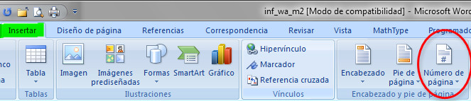
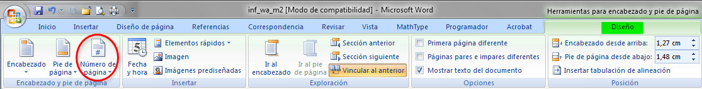
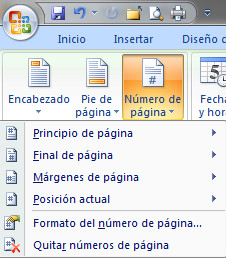
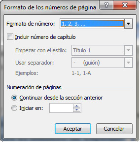

# Numeración de páginas (Word)

Los números de página suelen incluirse en los encabezados y pies de página, por eso, los trataremos en este apartado.

Existen varias formas de añadir el número de página:

1.  Desde la ficha Insertar, grupo Encabezado y pie de página.
2.  Desde la ficha Diseño (una vez que estemos dentro del encabezado o pie de página).

En cualquiera de los dos casos nos encontramos con una opción como las que puedes ver en las siguientes imágenes.

Las opciones disponibles al pinchar sobre este icono son las que puedes ver en la siguiente imagen:

De estas opciones, nos vamos a centrar en la penúltima **Formato del número de página**, ya que las anteriores suponemos que ya sabes para qué se utilizan. De esta forma, a través de la opción Formato es posible determinar qué tipo de numeración (árabe, romana o literal) deseamos incluir; si se incluye el número de capítulo y con qué formato o decidir en qué número se inicia. Si trabajamos en un documento dividido en secciones, puede determinarse si la numeración es continua o se reinicia en cada una de ellas, si tiene formato diferente para cada sección...

En el siguiente vídeo puedes ver cómo numerar páginas en Word.

https://youtu.be/ld-lZ4P5I8I

