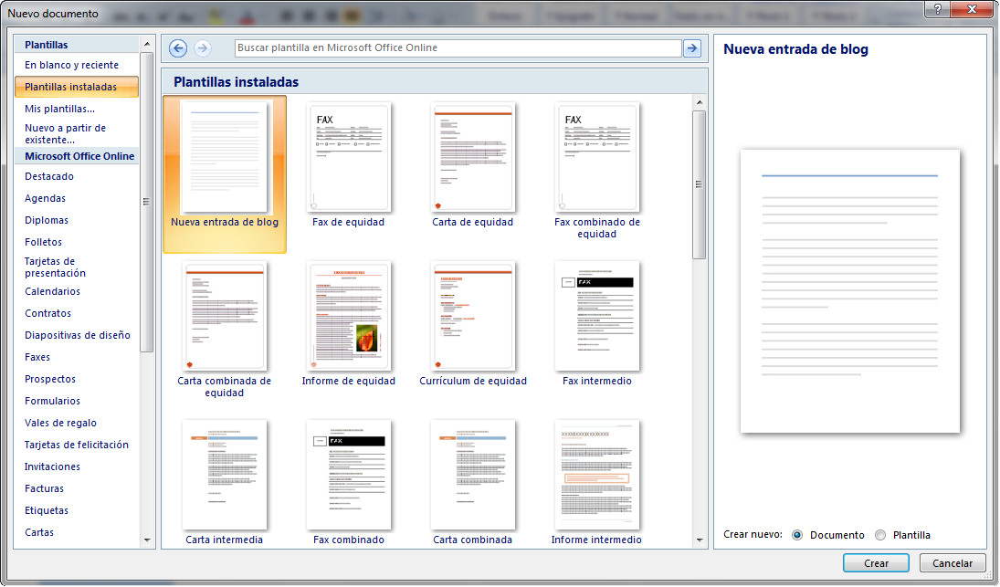

# Plantillas instaladas (Word)

Cada vez que creamos un nuevo archivo, Word proporciona una serie de plantillas predefinidas que pueden seleccionarse para hacer documentos. Aunque hay disponibles muchas plantillas, conviene que no trabajes ahora con todas porque algunas introducen conceptos que pueden resultarte desconocidos.

Si deseas crear un documento nuevo basado en una plantilla lo único que tienes que hacer es seleccionar la opción **Nuevo**, que está disponible en el Botón de Office, apareciendo un cuadro de diálogo como el que puedes ver en la siguiente imagen.

 _Fig. 1.37. Plantillas instaladas en Word 2007. Captura propia._

Cuando hayas elegido la plantilla que deseas utilizar, solo tienes que seleccionarlas y pulsar sobre el botón **Crear**.