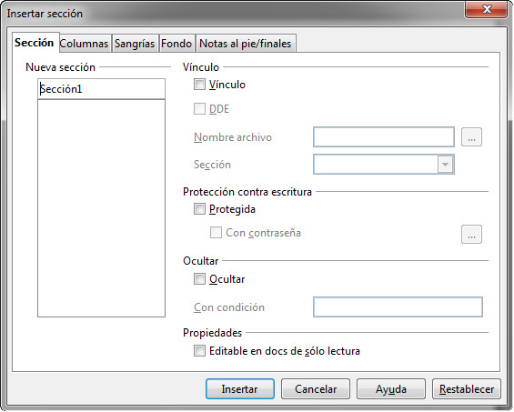
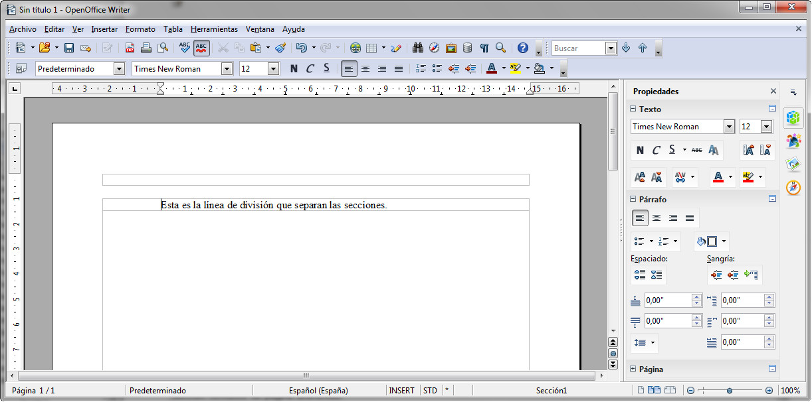

# Sección (OpenOffice)

Si trabajamos con OpenOffice Writer, en el menú Insertar, disponemos de la opción **Sección** que, al seleccionarla, nos aparecerá un cuadro de diálogo como el que puedes ver en la siguiente imagen.

_Fig. 1.16. Secciones en Write. Captura propia._

Al hacer clic sobre el botón Insertar, podremos ver cómo la ventana del documento nos aparece dividida, pudiendo establecer en cada sección formatos de página diferentes.

_Fig. 1.17. Visualización en pantalla de las divisiones de secciones en Write. Captura propia._