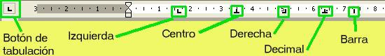

# Tabuladores

Las posiciones de los tabuladores se utilizan, sobre todo, para alinear columnas de texto. Hay distintos tipos de tabulaciones, siendo las más utilizadas las siguientes: **_izquierda_**, **_centrada_**, **_decimal_** y **_derecha_**. Para completar cada espacio entre tabulaciones, podemos elegir entre varios tipos de **relleno**.

En los siguientes enlaces tienes todo lo que necesitas para aprender a utilizar los tabuladores:

*   Tabuladores en [Word 2007](http://office.microsoft.com/es-es/word-help/establecer-tabulaciones-HP005188481.aspx?CTT=1 "Trabajando con tabuladores en Word 2007").
*   Tabuladores en [OpenOffice Writer](http://wiki.open-office.es/La_pesta%C3%B1a_Tabuladores "Trabajando con tabuladores en Writer").

## Importante

En cualquiera de los dos programas con los que estamos trabajando, puedes utilizar la regla para controlar los tabuladores. Mira la siguiente figura y lo entenderás.

Has de tener en cuenta que el tabulador barra es único de Word 2007, no pudiendo establecerlo con OpenOffice Writer.

