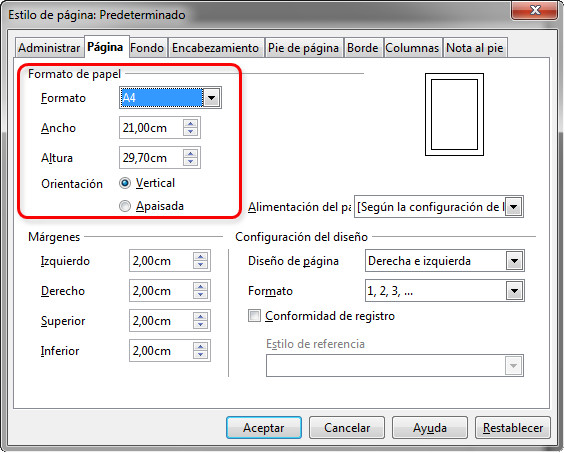

# Tamaño del papel (OpenOffice)

Al trabajar con OpenOffice Writer, la selección del tamaño del papel la tenemos en la misma pestaña que en la que modificamos los márgenes.

## Importante

Suponemos que ya habrás practicado un poco y habrás realizado modificaciones de los márgenes y del tamaño del papel con OpenOffice Writer. De todas formas, en el siguiente enlace tienes una breve explicación de cómo llevar a cabo estas acciones.

[Tutorial](http://www.aulaclic.es/openoffice/t_6_1.htm)