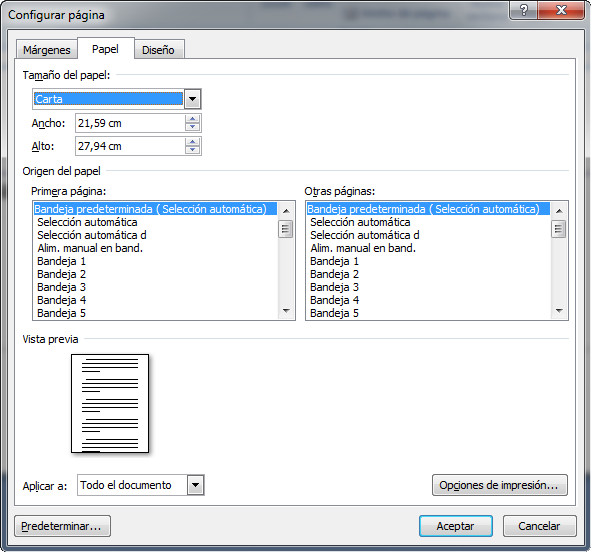

# Tamaño del papel (Word)

En la solapa Papel decidimos qué tipo de papel vamos a usar (habitualmente A4). La posibilidad de aplicar estos parámetros sólo a partes de un documento (texto seleccionado, secciones, de aquí en adelante, etc.) permite combinar, en un mismo archivo páginas de distintos tamaños.

## Importante

Ahora que ya sabes cómo cambiar los márgenes y el tamaño del papel, en el siguiente enlace puedes ver un videotutorial de cómo llevar a cabo estas operaciones con Word.

https://youtu.be/MJBgU4_NUPI