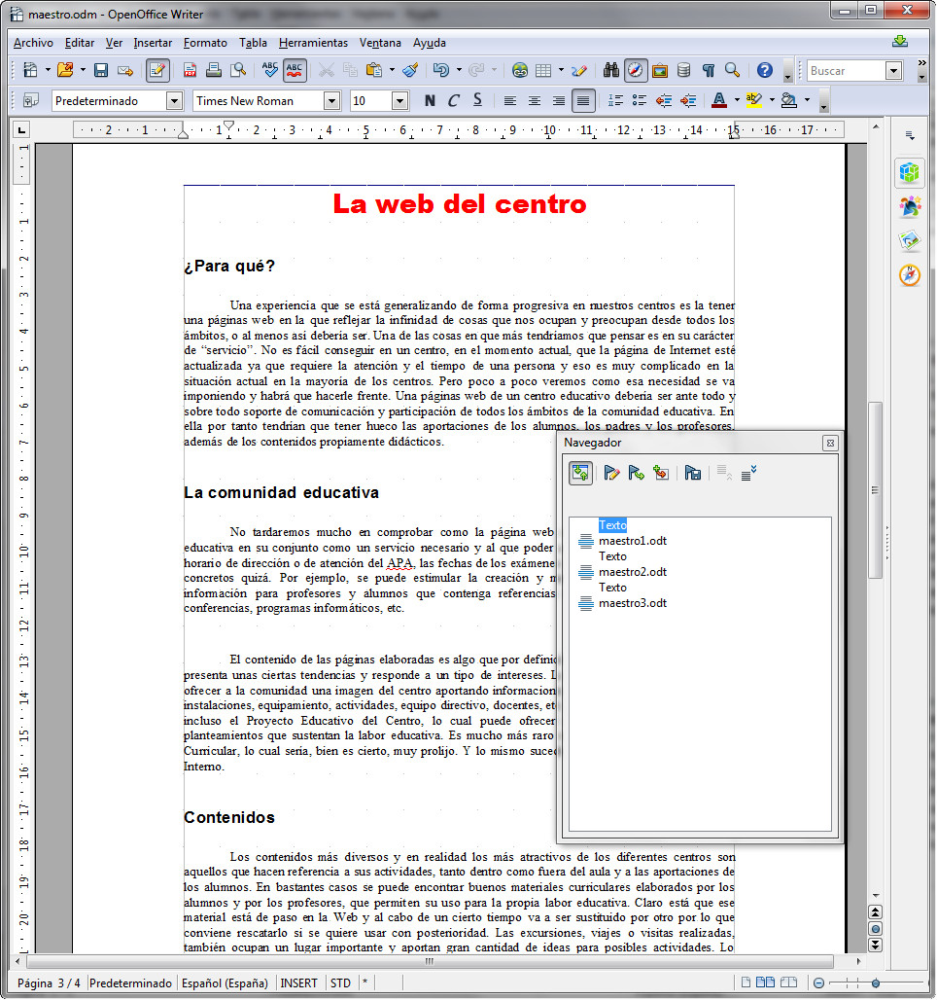
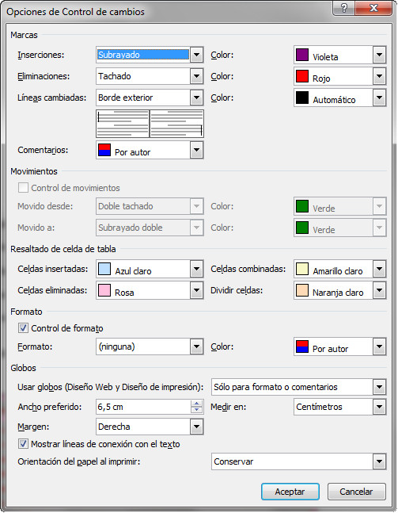

# Tipos de saltos de sección (Word)

Los tipos de saltos que se pueden incorporar en un documento son:

*   **Página siguiente**: Inserta un salto de sección, divide la página e inicia la nueva sección en la página siguiente.
*   **Continuo**: Inserta un salto de sección y empieza la siguiente sección en la misma página, a continuación del salto de sección. Esta opción permite, por ejemplo, que en una misma página convivan partes de texto con diferente número de columnas.
*   **Página impar o Página par**: Inserta un salto de sección y empieza la siguiente sección en la próxima página impar o par. Si estamos en una página impar e insertamos un salto de sección a la siguiente página impar, la página par intermedia no aparecerá y la numeración de páginas se saltará un número.

_Fig. 1.18. Configuración del comienzo de sección en Word 2007. Captura propia._

Tal y como se ha indicado anteriormente, la inserción de una salto de sección puede hacerse desde dos sitios, siendo el resultado el mismo.  
El procedimiento es el siguiente:

1.  Hacemos clic en el lugar del documento donde deseamos insertar el salto de sección.
2.  En la ficha Diseño de página, pinchamos en el triángulo que hay a la derecha de la opción Saltos apareciéndonos las distintas opciones relacionadas con los saltos de sección, tal y como puedes comprobar en la imagen inferior.
3.  Hacemos clic en la opción deseada.

_Fig. 1.19. Insercción de saltos de sección en Word 2007. Captura propia._

## Importante

Las opciones para elegir el tipo de salto de sección son excluyentes, de tal manera que solamente podemos seleccionar una de ellas.

Para modificar un salto de sección es necesario verlo, por eso hay que pasar a la vista normal o activar el icono Mostrar todo, tal y como te hemos explicado antes.

Entonces seleccionamos el salto de sección que deseamos cambiar: hacemos clic en dicho salto. En la ficha Diseño de página, accedemos en la configuración de página y, a continuación, elegiremos la ficha Diseño. En el desplegable de secciones, seleccionaremos el tipo.

Si lo que deseamos es eleminar un salto de sección, al igual que antes, es necesario verlo. Una vez que lo veamos en pantalla, lo seleccionamos y pulsamos sobre la tecla **SUPR**.

## Importante

Debes tener en cuenta que las opciones disponibles que tiene OpenOffice Writer en relación a las secciones no son tan variadas como las que tiene Word. Eso no significa que no se puedan realizar saltos de sección que, como has comprobado, sí que se puede hacer, pero trabajando siempre con el cuadro de diálogo que has visto en la lección anterior.