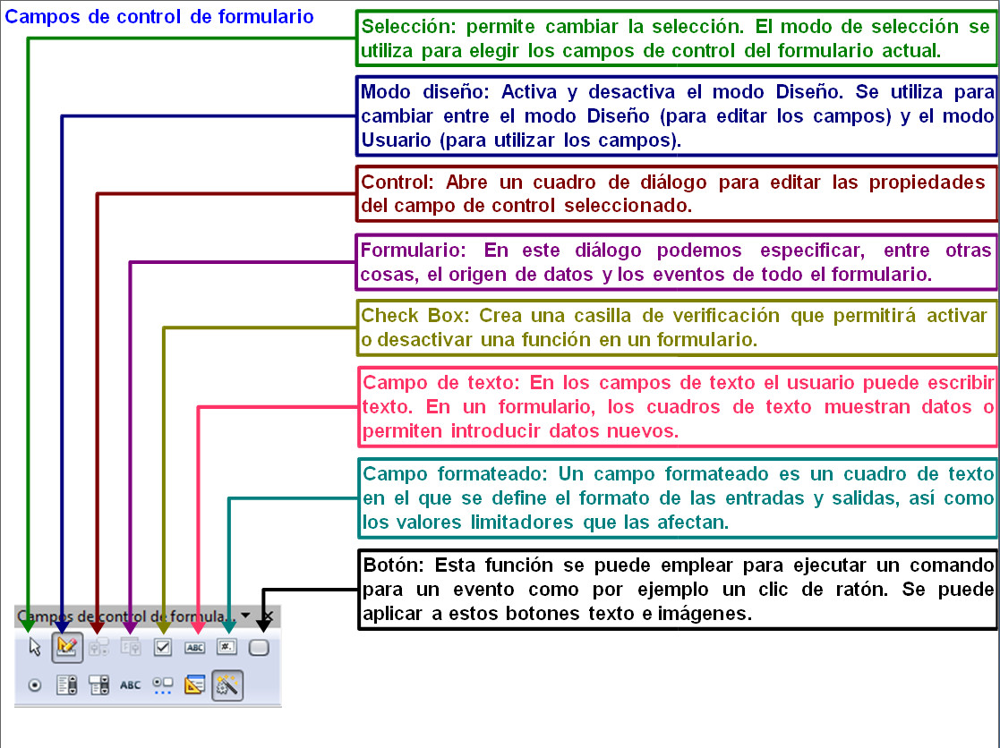
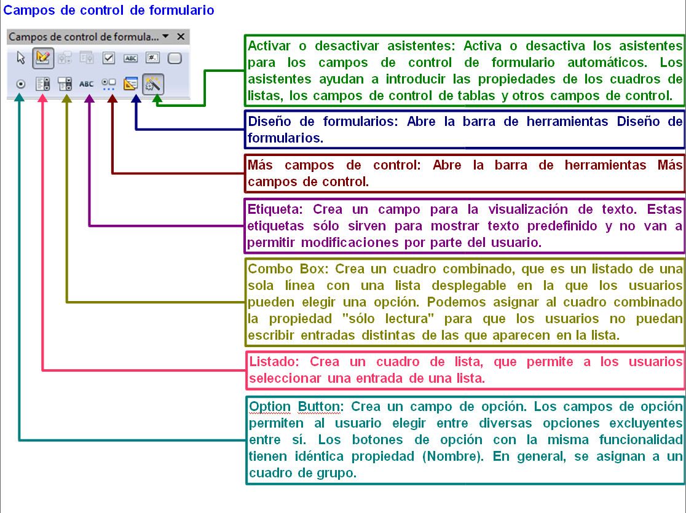
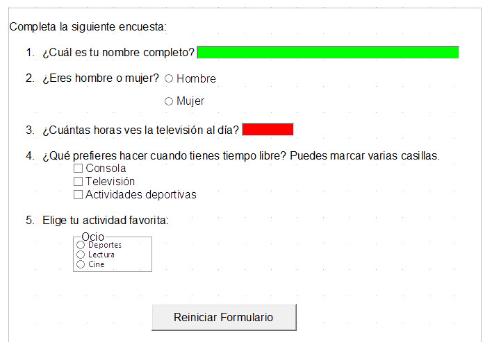

# Trabajando en OpenOffice Writer

Aunque en el apartado anterior te hemos explicado cuáles son los botones con los que trabaja Word 2007, es necesario incluirte las imágenes que puedes ver en la parte inferior con la explicación de los iconos con los que trabaja Writer, ya que difieren un poco con los que hemos visto anteriormente.

En el siguiente vídeo te explicamos cómo trabajar con estos controles del formulario para crear un documento.

https://youtu.be/c646qFrytI8

## Actividad

A continuación puedes ver una imagen en la que se pretende realizar una encuesta al alumnado. Con lo que has estudiado en este apartado, ¿serías capaz de realizarla?

¡¡Ánimo y adelante!!

