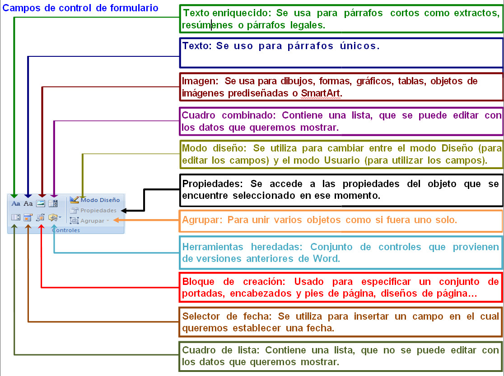

# Trabajando en Word 2007

Antes de explicar cómo se trabaja con los formularios, es muy conveniente que conozcas para qué sirven los botones que tienes disponibles a la hora de crearlos. Fíjate en esta imágen.

En el siguiente vídeo te explicamos cómo trabajar con estos controles del formulario para crear un documento.

https://youtu.be/U8eUfYVSVYc

## Actividad

Vas a practicar lo aprendido hasta ahora de formularios en Word. Para ello, realiza lo que a continuación te indicamos:

1.  Crea una plantilla nueva que guardarás con el nombre **tu-login cuestionario**.
2.  Escribe en la primera línea, "_**WORD 2007**_", y en la segunda "_**Cuestionario de evaluación**_". Formatea ambas como título de nivel 1.
3.  Escribe debajo, _"**1\. Para que aparezca el menú contextual hay que:"**
4.  A continuación. inserta una lista desplegable con los siguientes elementos:  
    
    *   _"**Selecciona la respuesta correcta**
    *   **_Pulsar el botón derecho (secundario) del ratón._**
    *   **_Pulsar el botón central del ratón._**
    *   **_Pulsar el botón izquierdo del ratón._**"
    
5.  Pulsa aceptar, pasa a la línea siguiente e introduce el siguiente texto: _"**2\. La opción Pegado Especial del Menú Edición sirve para:**_". Pasa a la línea siguiente pulsando SHIFT (flecha de mayúsculas e intro).
6.  Inserta una casilla de verificación, y escribe a continuación "**_Copiar el mismo formato de texto._**"
7.  Pasa a la línea siguiente usando el mismo procedimiento, vuelve a insertar una casilla de verificación y escribe a continuación: "**_Crear un vínculo entre dos documentos._**"
8.  Repite los mismos pasos, y escribe "_**Rehacer un cambio deshecho.**_"
9.  Pulsa intro.
10.  Escribe "**_3\. La barra de herramientas_**", inserta un campo de texto, con un tamaño máximo de 8 y sigue escribiendo "**_lleva, entre otros los comandos Nuevo, Abrir, Guardar e Imprimir._**"
11.  Ve a la línea siguiente, escribe el siguiente texto: "**_4\. Los_**" . A continuación, inserta una lista desplegable con los siguientes elementos:  
    
    *   _**Selecciona**
    *   _**Campos **
    *   _**Tabuladores**
    *   _**Formularios**
    
    No aceptes todavía, introduce como ayuda en la barra de estado: _"**elige la opción que consideres correcta**_."
12.  Y sigue escribiendo "**_sirven para hacer marcas en el documento que, posteriormente, permitirán alinear el texto tomándolas como referencia_**."
13.  Marca el rectángulo en el que aparece selecciona y pon el texto en color rojo y negrita.
14.  Entre este campo y el texto "**_sirven_**" es necesario dejar varios espacios adicionales (dependiendo del tipo y tamaño de letra que uses -tres o cuatro espacios para la letra times-) para evitar que, al entrar el en campo, la flecha que se añade al rectángulo oculte parte del texto siguiente.
15.  Escribe: "**_5\. Valora tus resultados._**" Inserta un campo desplegable en el que escribirás, como elementos, aunque te parezca raro:  
    
    *   **_JJJJ_**
    *   **_JJJL_**
    *   **_JJLL_**
    *   **_JLLL_**
    *   **_LLLL  
        _**
    
16.  No aceptes todavía, define como ayuda al pulsar **F1**, "**_selecciona las caritas sonrientes en función de las respuestas que crees tener acertadas_**".
17.  Pon este campo en tipo de letra **windings**, negrita y rojo, verás que las J se sustituyen por caras sonrientes y las L por caras tristes.
18.  Quita el sombreado de campo.
19.  Protege el formulario y guárdalo.

