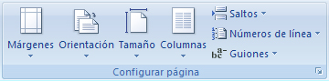
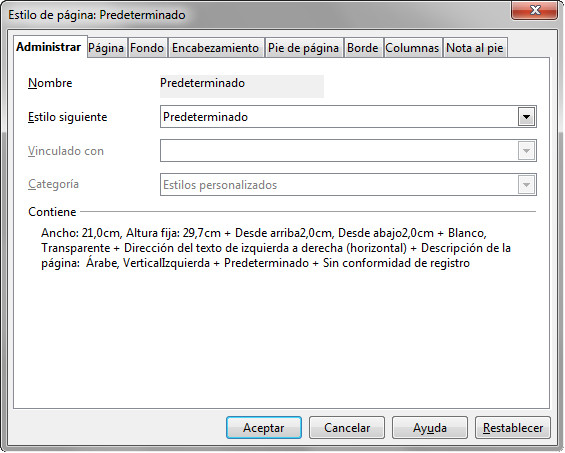
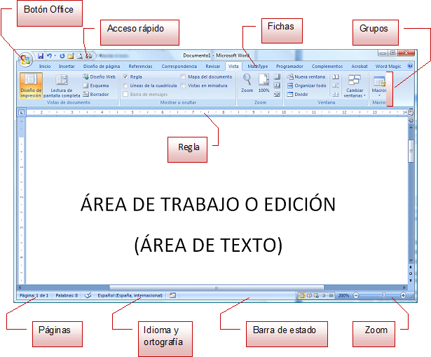
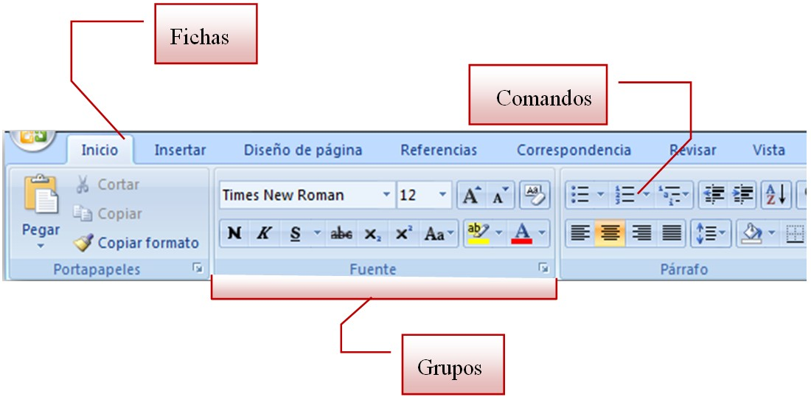
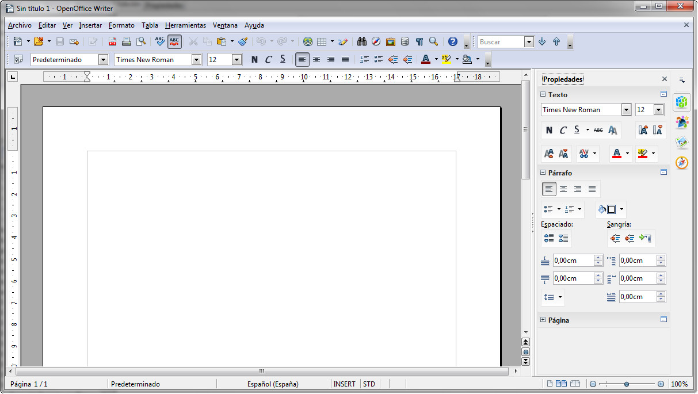

# U1. Configuración de página

De la configuración de página dependerá que nuestros documentos tengan el aspecto que deseemos. Entendemos que las opciones básicas relacionadas con la configuración de página (márgenes y orientación) ya las conoces, pero aquí queremos aprovechar para trabajar con algunas de sus utilidades menos conocidas.  
Antes de comenzar a trabajar con un documento, conviene tomarse un momento para decidir su estructura. Habitualmente trabajamos en hojas con orientación vertical, pero si queremos hacer un díptico, es mejor partir de la orientación apaisada. Es posible que necesitemos introducir páginas apaisadas entre otras verticales para poder insertar tablas que no caben en una hoja vertical. También es bastante habitual que fotocopiemos nuestros documentos por las dos caras, por lo que necesitaremos márgenes simétricos... Todo ello, se consigue determinar desde la configuración de página y a algunas de las tareas que se realizan desde esta opción, vamos a dedicar este primer apartado del módulo 1.

Dentro de la pestaña Diseño de página, disponemos de los iconos necesarios que nos permitirán hacer estas tareas.

Si trabajamos con OpenOffice, basta con seleccionar la opción Página del menú Formato.

1.3. Cuadro de diálogo para la Configuración de página en Writer. Captura propia.

## Importante

La estructura de la ventana de Word es la siguiente:

De la misma forma, los componentes básicos de la Cinta de Opciones son:

En el caso de trabajar con OpenOffice Writer, la ventana tiene un modelo mucho más clásico, tal y como puedes ver en la siguiente imagen:

