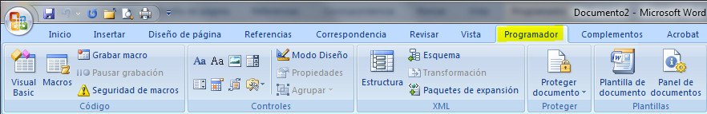
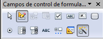

# U1. Formularios

>**info**
>
>## Importante
>
>Dependiendo del antivirus que tengas instalado es posible que tengas algún problema con los formularios. Si te sucede esto, desactívalo momentaneamente.

Para empezar con esta unidad sería necesario saber qué es un formulario. Pues bien, podemos decir que un formulario es un documento electrónico destinado a ser rellenado por los usuarios mediante verificaciones de casillas, elecciones en listas o rellenado de campos. Este documento suele partir de una plantilla en la que está creado el formulario y su destino puede ser guardarlo en disco, imprimirlo, enviarlo por correo electrónico e, incluso, publicarlo en la Web.

Es habitual que en los centros educativos usemos fichas para recabar datos personales. Estas fichas pueden ser rellenadas a mano, pero los procesadores de textos nos permiten la creación de formularios electrónicos que pueden ser rellenados en el propio ordenador mediante la introducción de campos.

Los formularios abren un interesante campo en las aplicaciones didácticas, ya que permiten elaborar cuestionarios que el alumnado puede rellenar manualmente o en el ordenador; en este caso, el cuestionario nos lo puede devolver en papel, en soporte electrónico o por email.

## Importante

Debes tener en cuenta que, como lo habitual es que un formulario sea rellenado por más de un usuario, lo ideal es crear una plantilla que, al abrirla, se convierta en documento.

Por defecto, ni en Microsoft Word ni en OpenOffice Writer, podemos trabajar directamente con los formularios, ya que es necesario activar la opción correspondiente.

1.  Para Word 2007 tienes que activar la ficha **Programador**, siguiendo los pasos que puedes ver en el siguiente enlace: [activar la ficha Programador](http://office.microsoft.com/es-es/word-help/crear-formularios-que-los-usuarios-rellenan-en-word-HA010030746.aspx?CTT=1#BM1 "Cómo activar la ficha Programador en Word"). Una vez activada, tendrás una nueva ficha con las opciones que puedes visualizar en la siguiente imagen:
    
    
    
1.  Para OpenOffice Writer es necesario que visualices la barra de herramientas **Campos de control de formulario**. Para visualizarla, solamente tienes que hacer clic en el menú Ver, opción Barras de herramientas, y seleccionarla. La barra de herramientas que visualizarás es la que te mostramos en la siguiente imagen.  
    

    

## Reflexión

Te hemos explicado un poco qué es un formulario y para qué sirve. ¿Cómo crees que lo puedes utilizar tú en el aula?

%accordion%Solución%accordion%

Posibles aplicaciones de los formularios en el aula son:

*   Realización de pruebas.
*   Cumplimentación de fichas de alumnos.

%/accordion%

