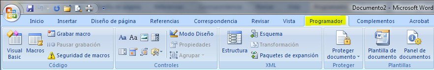

# U1. Opciones de párrafo y línea

**El párrafo**

Antes de empezar a trabajar con párrafos debemos de conocer qué entiende un procesador de textos como párrafo. Pues bien, podríamos decir que un párrafo es lo que hay entre un punto y aparte y otro.

Los opciones que podemos realizar con un párrafo son:

*   Sangrías.
*   Espaciados.
*   Interlineados.
*   Alineaciones.
*   Tabuladores.
*   Numeración y viñetas.
*   Bordes y sombreado.

Fíjate en la siguiente imagen, tienes un documento en el que podrás ver todas las opciones que se pueden realizar con un párrafo.

_Fig. 2.3. Documento con diversas opciones de párrafo. Captura propia._

## Importante

Es conveniente que utilices las diversas opciones relacionadas con el párrafo para dar una apariencia a nuestro documento mucho más atractiva.

Por ejemplo, para conseguir el efecto de una sangría de primera línea puedo pulsar varias veces la barra espaciadora, pero esto lo tendré que ir haciendo en todos los párrafos, pudiendo establecer separaciones diferentes en cada párrafo. Por este motivo, es mucho mejor utilizar la sangría, ya que se irá repitiendo en todos los párrafos hasta que le indique lo contrario.

