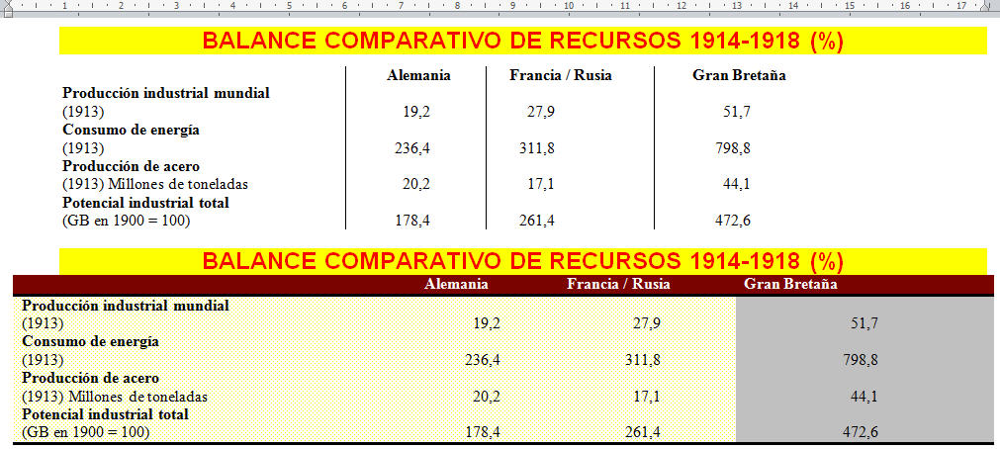

# U2. Columnas y tabuladores

Hay usuarios de procesadores de textos que prefieren trabajar con tablas a la hora de utilizar columnas o tabuladores; no negaremos aquí que se trata de una buena idea, de hecho dedicamos una unidad a hablar de ello, sin embargo, en un curso avanzado de procesadores de textos, es necesario conocer estas opciones.

Fíjate en esta imagen, ¿sabrías identificar qué se ha realizado con una tabla, con columnas o con tabuladores?

¿Has conseguido averiguarlo? Pues bien, a simple vista es difícil saber cómo se ha realizado. La parte superior se ha realizado con tabuladores (¿a qué parecía que se había hecho con columnas? La parte inferior se ha realizado con una tabla.

Cuando finalices esta unidad serás capaz de realizar documentos con un aspecto similar al de la imagen.

