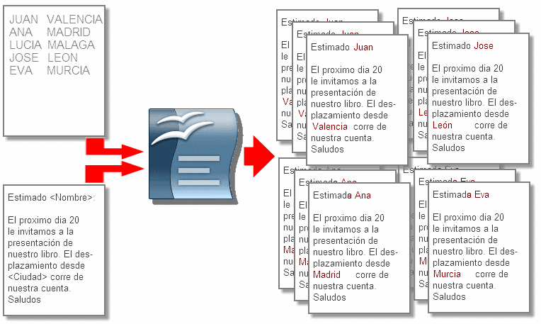

# U2. Combinar correspondencia

Pese a que el programa denomina así a este función, su uso es más general que el de la elaboración de cartas personalizadas. Combinar correspondencia permite asociar datos a un documento de texto, de forma que al imprimir el documento o guardarlo como archivo de impresión, el procesador de textos hará tantas copias como registros diferentes haya.

El ejemplo más claro puede ser una carta enviada a nuestros alumnos. Lógicamente, la fuente de datos deberá contener su nombre, apellidos y dirección, además de otras cuestiones particulares de cada uno, por ejemplo una calificación. A la hora de imprimir, se hará un documento para cada alumno. Pero este origen de datos puede servirnos también para hacer etiquetas postales, y con algún campo más, para rellenar informes de forma automática.

## Importante

La combinación de correspondencia supone introducir información en un documento (documento principal) obtenida de otro documento (el origen de datos) para crear otro nuevo que contendrá la información de ambos, tal y como te representamos gráficamente en la siguiente imagen.

_Fig. 5.9. Esquema de la combinación de correspondencia. Fuente wiki.open-office.es._

