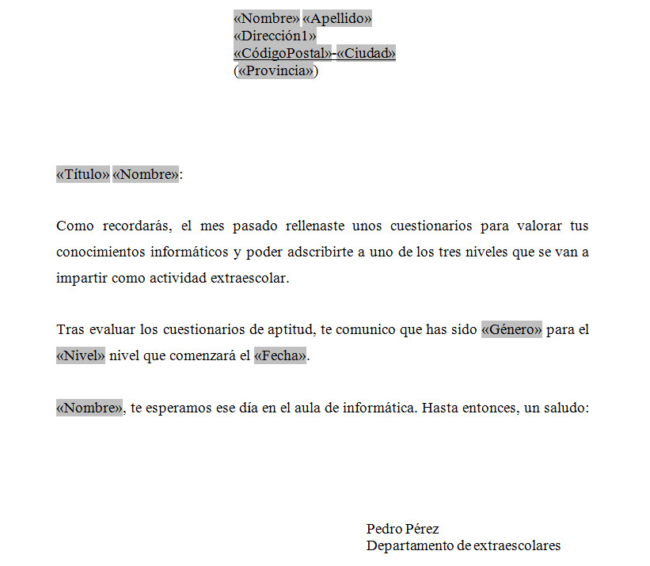
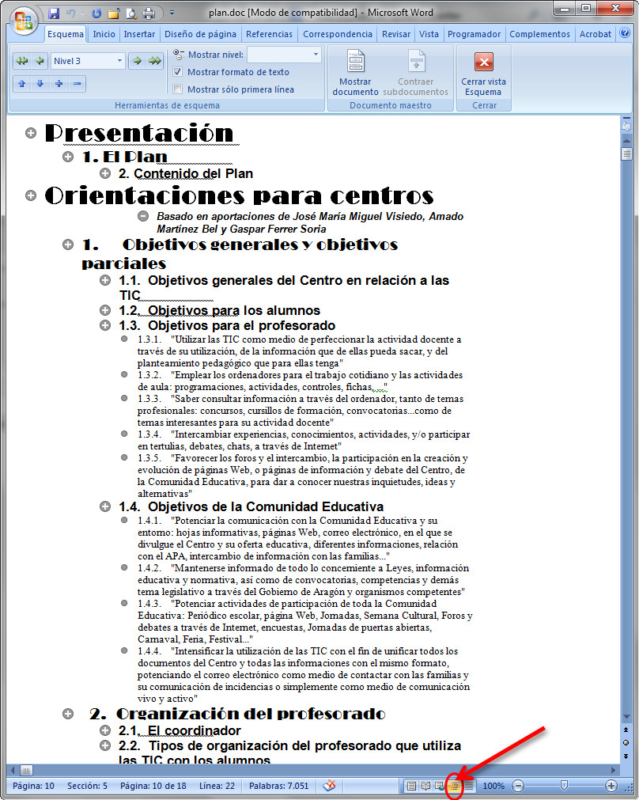
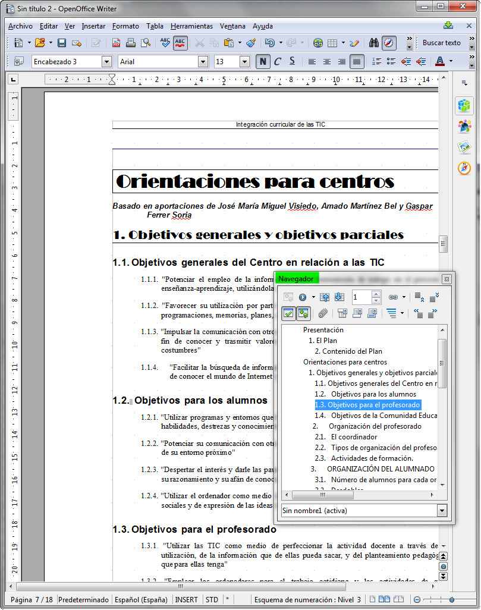

# U3. Tablas

Aunque suponemos que lo sabrás, no está de más realizar una breve explicación de lo que son las tablas. Pues bien, podemos decir que las tablas son un modo de organizar visualmente la información con un carácter _sistemático_: un horario, una serie estadística que muestre las precipitaciones medias en años sucesivos, una sucesión de los ingresos y gastos habidos en los diversos meses del año, la distribución de las notas de los alumnos por cada evaluación...

Se componen de una serie de _filas_ y de _columnas_; la intersección de una fila y una columna forma una _celda_, que constituye así la unidad mínima de la tabla. Cada celda puede tener un cierto formato, de párrafo (alineación, interlineado, espaciado) y de carácter; además, se puede especificar el tipo de líneas que la rodean, así como su color de fondo. Combinando los colores de fondo de las celdas y líneas con diversas hechuras podemos conformar diferentes _estilos_ de tabla.

## Conocimiento previo

Para comprobar que te acuerdas cómo se trabaja de manera básica con las tablas, vas a realizar el siguiente ejercicio:

1.  Crea un documento nuevo en blanco.
2.  Inserta una tabla de 3 columnas y 4 filas.
3.  Inserta una fila en la parte superior.
4.  Inserta una columna a la derecha. _Si no has desmarcado la fila insertada, se añadirán tantas columnas como haya marcadas (en este caso 3)._
5.  Combina todas las celdas de la primera fila.
6.  Combina todas las celdas de la última fila.
7.  Combina las celdas 2ª, 3ª y 4ª de la primera columna.
8.  Divide la última fila en dos columnas.
9.  Cambia, manualmente, el ancho de la tercera columna, dejando el borde derecho en el punto 10 cm. de la regla.
10.  Cambia, manualmente, el ancho de la segunda columna, dejando el borde izquierdo en el punto 5,75 de la regla.
11.  Rellena la primera fila de negro.
12.  En la primera columna, rellena la celda grande de amarillo.
13.  En las columnas segunda y tercera, rellena las celdas pequeñas de verde lima.
14.  Rellena las celdas pequeñas de la última columna de amarillo.
15.  Rellena la última fila de lavanda.
16.  Aplica, a toda la tabla, un borde exterior doble.
17.  Aplica un borde simple de 2 ¼ a los bordes derechos de la segunda celda de las filas segunda, tercera y cuarta y a la primera celda de la última fila.
18.  Te quedará una tabla, más o menos, como ésta:

 

 _Fig. 2.12. E__jemplo de una tabla. Captura propia.  
_

Fíjate en las siguientes imágenes:

_Fig. 2.13. y 2.14. Ejemplos del uso de tablas. Capturas propias._

En ambos casos se han utilizado las tablas para realizar el documento. Con el uso de las mismas, como puedes comprobar, puedes realizar muchos trabajos con una presentación mucho más cuidada.

