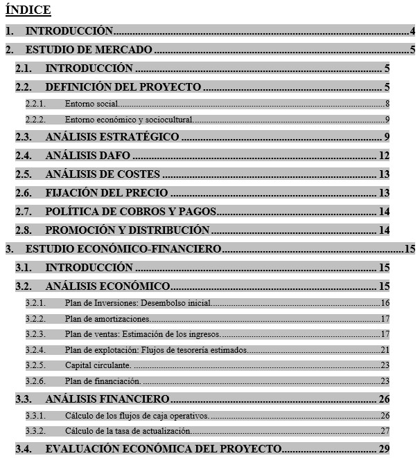

# U3. Tablas de contenido

Seguro que alguna vez has tenido que presentar un documento en el que has de poner un índice con los diferentes capítulos y en la página que se encuentra cada uno, como el que te mostramos en la siguiente imagen.

¡¡Esto se realiza de forma automática con una tabla de contenido!!

>**info**
>
>## Importante
>
>Una tabla de contenido es una lista de los títulos de un documento que se puede insertar en una ubicación específica; puede utilizarse, como índice, para obtener información general acerca de los temas que se tratan en un documento, o para buscar un tema rápidamente, ya que los elementos de la tabla de contenido quedan enlazados automáticamente con sus referencias.

Para saber cómo se inserta una tabla de contenido en cada uno de los programas, accede a los siguientes videotutoriales:

https://youtu.be/BSixFwdocEE

https://youtu.be/l-3OxG6u34M

## Actividad

Ahora te toca practicar a ti. Abre el archivo [metodologia](http://aularagon.catedu.es/materialesaularagon2013/word/Documentos/metodologia.docx "Autoevaluación Tablas de Contenido") (si trabajas con Writer abre este archivo [metodologia](http://aularagon.catedu.es/materialesaularagon2013/word/Documentos/metodologia.odt "Autoevaluación Tablas de Contenido")) y realiza una tabla (o índice) de contenido.

