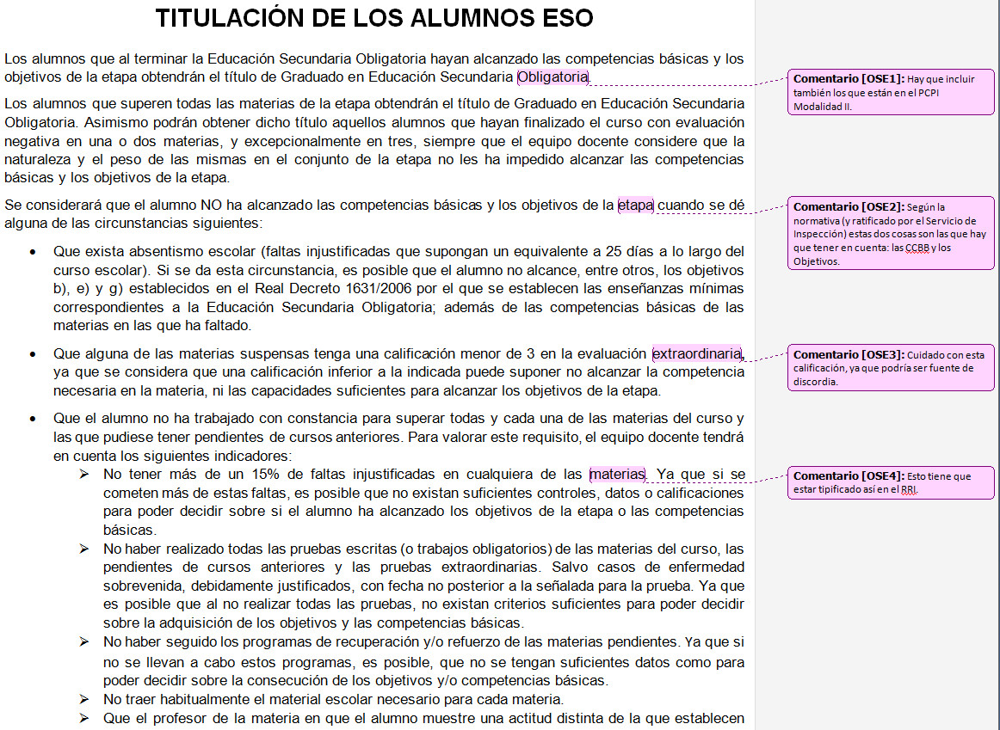
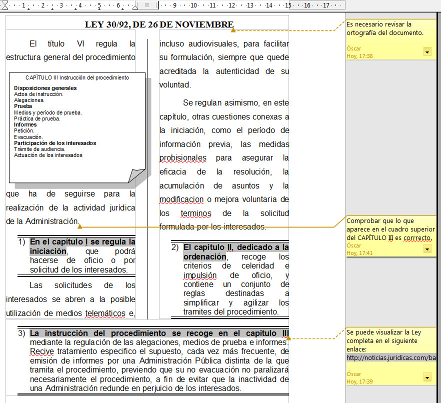
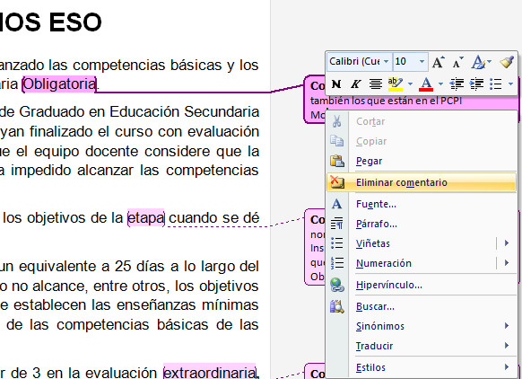
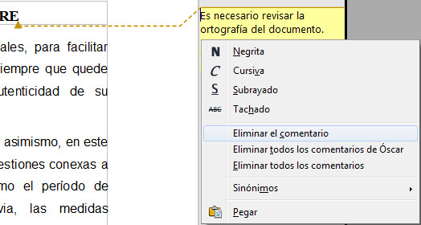

# U3. Trabajando con comentarios

Los comentarios son observaciones que introducimos al documento y que no ponemos en notas al pie; digamos que el comentario es una nota para ser vista u oída en pantalla.

Fíjate en estas dos imágenes:

 

_Fig. 3.16. Comentarios en Word 2007. Captura propia._

_Fig. 3.17. Comentarios en OpenOffice Writer. Captura propia._

Como puedes comprobar, tanto en Word como en OpenOffice Writer, los comentarios se insertan como "globos" en la parte derecha del margen. Estos comentarios no se usan sólo en el control de cambios, en cualquier documento puedes insertar comentarios interesantes para tus alumnos o hacer que ellos respondan a cuestiones planteadas o introduzcan aclaraciones al contenido mediante comentarios.

## Importante

La insercción de un comentario se realiza:

*   En Word 2007: Desde la ficha Revisar, opción **Nuevo comentario**.
*   En OpenOffice Writer: Desde el menú Insertar, opción **Comentario**.

Para modificar el texto escrito en el comentario basta con posicionarse dentro del globo y modificar el texto.

Para eliminar un comentario, colocamos el puntero del ratón dentro del mismo, hacemos click con el botón derecho del ratón y tendremos la opción de eliminarlo, tal y como puedes observar en las siguientes imágenes.

_Fig. 3.18. Eliminar un comentario en Word. Captura propia._

_Fig. 3.19. Eliminar un comentario en Writer. Captura propia._

