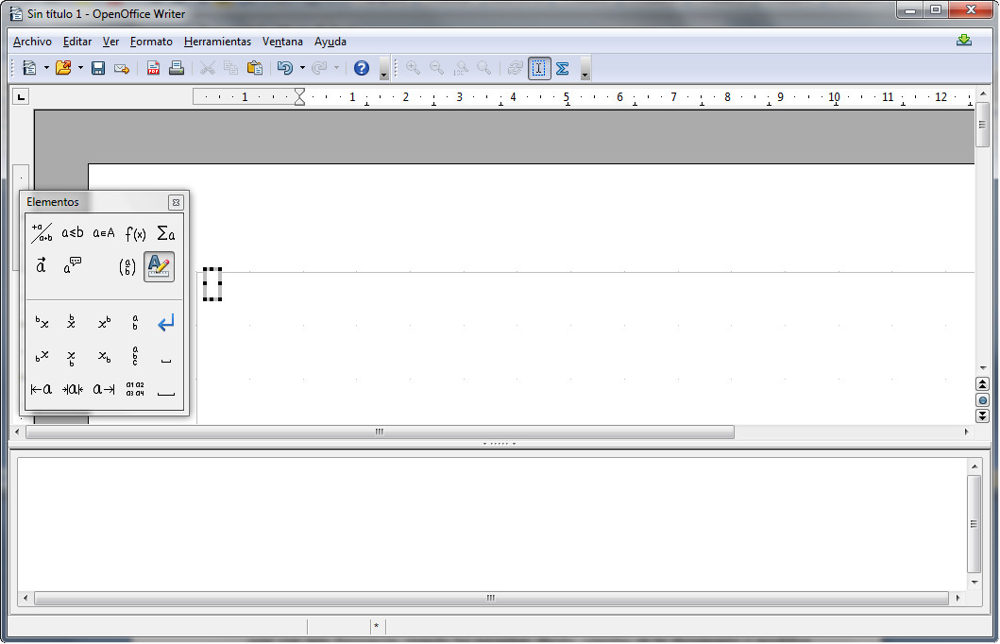

# U5. Editor de ecuaciones

Muchos trabajos de investigación científicos y matemáticos presentan demostraciones y resultados de forma matemática. Las fórmulas matemáticas suelen incluir símbolos y estructuras de caracteres que no son normales en documentos fuera del ámbito científico.  
  
Los procesadores de texto incluyen el **Editor de ecuaciones** con el que se pueden insertar símbolos, ecuaciones, etc., para crear fórmulas matemáticas. El editor de ecuaciones proporciona las partes de la estructura de una fórmula en las que puedes pegar números, texto, símbolos y otras estructuras adicionales.

Tanto en Word 2007 como en OpenOffice Write, al insertar una ecuación se nos abren opciones específicas para trabajar con él, tal y como puedes ver en las siguientes imágenes.

_Fig. 4.8. Herramientas para la creación y edición de ecuaciones en Word 2007. Captura propia._

_Fig. 4.9. Herramientas para la creación y edición de ecuaciones en OpenOffice Write. Captura propia._

Para saber cómo se trabaja con el editor de ecuaciones, accede a los siguientes enlaces:

*   Ecuaciones en [Word 2007](http://office.microsoft.com/es-es/word-help/escribir-insertar-o-cambiar-una-ecuacion-HA001230361.aspx?CTT=5&origin=HA001230366 "Editor de ecuaciones de Word").
*   Ecuaciones en [OpenOffice Writer](http://wiki.open-office.es/Math "Editor de ecuaciones de Write").

## Importante

El proceso de trabajo con el editor de ecuaciones es largo y complejo hasta que se adquiere una cierta destreza y, aún entonces, no es rápido. Para evitar elaboraciones tediosas, puedes hacer uso de alguna de estas recomendaciones:

*   Crea un documento en el que incluirás modelos de las expresiones matemáticas que vayas a usar con más frecuencia, cuando las necesites, ábrelo, cópialas en tu documento y modifica los valores.
*   Una variante del anterior: ese documento puedes crearlo la primera vez que trabajes con el editor en un texto. Copia la ecuación y pégala en tu documento de ecuaciones, ya tienes una. Haz lo mismo cuando crees otro tipo de expresión y así sucesivamente. Al finalizar el curso, tendrás todos los modelos que necesitas.

Tal y como te hemos indicado anteriormente, trabajar con ecuaciones es un proceso un poco tedioso, sobre todo al principio. Además, hay que tener en cuenta que las herramientas disponibles para la creación y edición de ecuaciones son muy numerosas.

A continuación te presentamos dos videotutoriales por si quieres afianzar los conceptos.

 _Vídeo 4.9. Editor de ecuaciones de Word. Fuente: Youtube._

  _Vídeo 4.10. Editor de ecuaciones de Write. Fuente: Youtube._

## Actividad

Después de todo lo que has podido leer o visualizar seguro que eres capaz de realizar muchas ecuaciones. ¡¡Vamos a comprobarlo!!

Practica con la fórmula de la ecuación de segundo grado. Por si no te acuerdas es la siguiente:

_Fig.4.10. Fórmula de la ecuación de segundo grado. Captura propia._

Aunque sabemos que esta fórmula Word la puede establecer automáticamente, ya que aparece en el listado de elementos rápidos, ¡¡no hagas trampa y realízala tú!!

Si eres del ámbito científico-tecnológico, puedes elegir cualquier modelo de expresión compleja.

