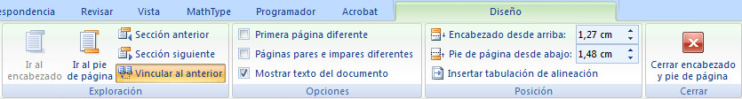
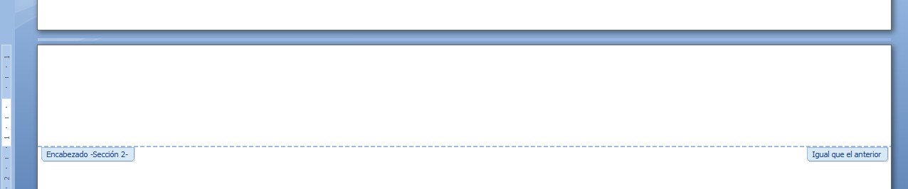

# Vincular al anterior (Word)

Si se quieren hacer encabezados y pies alternos, si se quieren diferenciar los encabezados y pies de distintas secciones del documento o ambas cosas, es necesario conocer el funcionamiento de la opción **Vincular al anterior**, que aparece en la ficha Diseño, grupo Exploración, pues nos puede causar no pocos quebraderos de cabeza.

Pero, ¿cómo funciona esta opción de Vincular al anterior? Presta atención.

Supón que hemos hecho un encabezado y vamos al siguiente, allí escribimos un encabezado distinto al anterior. Si el icono "Vincular al anterior" está activado, el primer encabezado que hemos hecho cambiará también, quedando igual que el segundo (que acabamos de hacer). Por eso, en estos casos de encabezados y pies complejos, lo más conveniente es desactivar esta opción desde el principio y comprobar que en el rectángulo que delimita la zona de encabezados o pies no figura, en ningún caso, la expresión "Igual que el anterior", tal y como puedes ver en la siguiente imagen.

